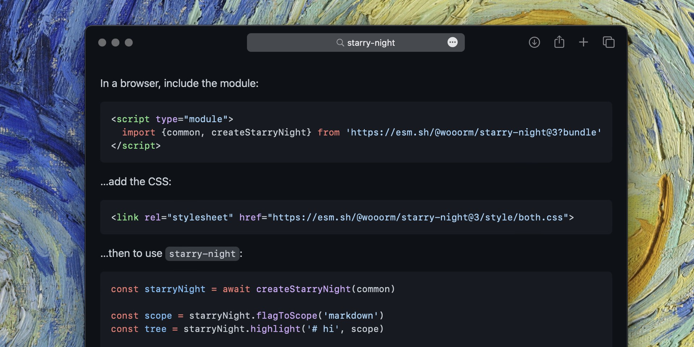

[](https://artsandculture.google.com/asset/the-starry-night/bgEuwDxel93-Pg#gh-dark-mode-only)
[](https://artsandculture.google.com/asset/the-starry-night/bgEuwDxel93-Pg#gh-light-mode-only)

<p align="center">Close up of <b>The Starry Night</b> by Vincent van Gogh (1889)<br>with examples of <code>starry-night</code> over it</p>

<br>

# starry-night

[![Build][build-badge]][build]
[![Coverage][coverage-badge]][coverage]
[![Downloads][downloads-badge]][downloads]
[![Size][size-badge]][size]

Syntax highlighting, like what GitHub uses to highlight code, but free and open
source and JavaScript!

## Contents

* [What is this?](#what-is-this)
* [When should I use this?](#when-should-i-use-this)
* [What is `PrettyLights`?](#what-is-prettylights)
* [Install](#install)
* [Use](#use)
* [API](#api)
  * [`all`](#all)
  * [`common`](#common)
  * [`createStarryNight(grammars[, options])`](#createstarrynightgrammars-options)
  * [`starryNight.flagToScope(flag)`](#starrynightflagtoscopeflag)
  * [`starryNight.highlight(value, scope)`](#starrynighthighlightvalue-scope)
  * [`starryNight.missingScopes()`](#starrynightmissingscopes)
  * [`starryNight.register(grammars)`](#starrynightregistergrammars)
  * [`starryNight.scopes()`](#starrynightscopes)
  * [`GetOnigurumaUrl`](#getonigurumaurl)
  * [`Grammar`](#grammar)
  * [`Options`](#options)
* [Examples](#examples)
  * [Example: serializing hast as html](#example-serializing-hast-as-html)
  * [Example: using `starry-night` on the client](#example-using-starry-night-on-the-client)
  * [Example: turning hast into react nodes](#example-turning-hast-into-react-nodes)
  * [Example: adding line numbers](#example-adding-line-numbers)
  * [Example: integrate with unified, remark, and rehype](#example-integrate-with-unified-remark-and-rehype)
  * [Example: integrating with `markdown-it`](#example-integrating-with-markdown-it)
* [Syntax tree](#syntax-tree)
* [CSS](#css)
* [Languages](#languages)
* [Types](#types)
* [Compatibility](#compatibility)
* [Security](#security)
* [Related](#related)
* [Contribute](#contribute)
* [License](#license)

## What is this?

This package is an open source version of GitHub’s closed-source `PrettyLights`
project (more on that later).
It supports **600+ grammars** and its **extremely high quality**.
It uses TextMate grammars which are also used in popular editors (SublimeText,
Atom, VS Code, \&c).
They’re heavy but high quality.

## When should I use this?

`starry-night` is a **high quality** highlighter
(when your readers or authors are programmers, you want this!)
that can support **tons of grammars**
(from new things like MDX to much more!)
which approaches how GitHub renders code.

It has a WASM dependency, and rather big grammars, which means that
`starry-night` might be too heavy particularly in browsers, in which case
[`lowlight`][lowlight] or [`refractor`][refractor] might be more suitable.

This project is similar to the excellent [`shiki`][shiki], and it uses the same
underlying dependencies, but `starry-night` is meant to match GitHub in that it
produces classes and works with the CSS it ships, making it easier to add dark
mode and other themes with CSS compared to inline styles.

Finally, this package produces objects (an AST), which makes it useful when you
want to perform syntax highlighting in a place where serialized HTML wouldn’t
work or wouldn’t work well.
For example, when you want to show code in a CLI by rendering to ANSI sequences,
when you’re using virtual DOM frameworks (such as React or Preact) so that
diffing can be performant, or when you’re working with [`hast`][hast] or
[`rehype`][rehype].

Bundled, minified, and gzipped, `starry-night` and the WASM binary are 185 kB.
There are two lists of grammars you can use: [`common`][api-common] (±35
languages, good for your own site) adds 250 kB and [`all`][api-all] (\~600
languages, useful if you are making a site like GitHub) is 1.6 MB.
You can also manually choose which grammars to include (or add to `common`): a
language is typically between 3 and 5 kB.
To illustrate, Astro costs 2.1 kB and TSX costs 25.4 kB.

## What is `PrettyLights`?

`PrettyLights` is the syntax highlighter that GitHub uses to turn this:

````markdown
```markdown
# Hello, world!
```
````

…into this:

```html
<span class="pl-mh"><span class="pl-mh">#</span><span class="pl-mh"> </span>Hello, world!</span>
```

…which is what `starry-night` does too (some small differences in markup, but
essentially the same)!

`PrettyLights` is responsible for taking the flag `markdown`, looking it up in
[`languages.yml`][languages-yml] from `github-linguist` to figure out that that
means markdown, taking a corresponding grammar (in this case
[`wooorm/markdown-tm-language`][markdown-tm-language]),
doing some GPL magic in C,
and turning it into spans with classes.

GitHub is using `PrettyLights` since December 2014, when it
[replaced `Pygments`][ref-1].
They wanted to open source it, but [were unable][ref-2] due to licensing issues.
Recently ([Feb 2019][ref-3]?), GitHub has slowly started to move towards
`TreeLights`, which is based on TreeSitter, and also closed source.
If `TreeLights` includes a language (currently: C, C#, CSS, CodeQL, EJS, Elixir,
ERB, Gleam, Go, HTML, Java, JS, Nix, PHP, Python, RegEx, Ruby, Rust, TLA, TS),
that’ll be used, for everything else `PrettyLights` is used.

`starry-night` does what `PrettyLights` does, not what `TreeLights` does.
I’m hopeful that that will be open sourced in the future and we can mimic both.

<br>

[][ref]

## Install

This package is [ESM only][esm].
In Node.js (version 16+), install with [npm][]:

```sh
npm install @wooorm/starry-night
```

In Deno with [`esm.sh`][esmsh]:

```js
import {common, createStarryNight} from 'https://esm.sh/@wooorm/starry-night@3'
```

In browsers with [`esm.sh`][esmsh]:

```html
<script type="module">
  import {common, createStarryNight} from 'https://esm.sh/@wooorm/starry-night@3?bundle'
</script>
```

To get the CSS in browsers, do (see [CSS][] for more info):

```html
<!-- This supports light and dark mode automatically. -->
<link rel="stylesheet" href="https://esm.sh/@wooorm/starry-night@3/style/both">
```

## Use

```js
import {common, createStarryNight} from '@wooorm/starry-night'

const starryNight = await createStarryNight(common)

const scope = starryNight.flagToScope('markdown')
const tree = starryNight.highlight('# hi', scope)

console.log(tree)
```

Yields:

```js
{
  type: 'root',
  children: [
    {
      type: 'element',
      tagName: 'span',
      properties: {className: ['pl-mh']},
      children: [
        {type: 'text', value: '# '},
        {
          type: 'element',
          tagName: 'span',
          properties: {className: ['pl-en']},
          children: [{type: 'text', value: 'hi'}]
        }
      ]
    }
  ]
}
```

## API

This package exports the identifiers [`all`][api-all],
[`common`][api-common], and [`createStarryNight`][api-create-starry-night] from
the main module.
There is no default export.

It also includes grammars directly in its export map.
**Do not** use the `lang/` folder or the `.js` extension.
For CSS files, do use `style/` but don’t use `.css`:

```js
import mdx from '@wooorm/starry-night/source.mdx' // Grammar.
import tritanopiaDark from '@wooorm/starry-night/style/tritanopia-dark' // CSS.
```

### `all`

List of all grammars ([`Array<Grammar>`][api-grammar])

### `common`

List of ±35 common grammars ([`Array<Grammar>`][api-grammar])

### `createStarryNight(grammars[, options])`

Create a `StarryNight` that can highlight things with the given `grammars`.
This is async to allow async loading and registering, which is currently
only used for WASM.

###### Parameters

* `grammars` ([`Array<Grammar>`][api-grammar])
  — grammars to support
* `options` ([`Options`][api-options], optional)
  — configuration

###### Returns

Promise that resolves to an instance which highlights with the bound
grammars (`Promise<StarryNight>`).

### `starryNight.flagToScope(flag)`

Get the grammar scope (such as `text.md`) associated with a grammar name
(such as `markdown`) or grammar extension (such as `.mdwn`).

This function uses the first word (when splitting on spaces and tabs) that is
used after the opening of a fenced code block:

````markdown
```js
console.log(1)
```
````

To match GitHub, this also accepts entire paths:

````markdown
```path/to/example.js
console.log(1)
```
````

> 👉 **Note**: languages can use the same extensions.
> For example, `.h` is reused by many languages.
> In those cases, you will get one scope back, but it might not be the
> most popular language associated with an extension.

###### Parameters

* `flag` (`string`)
  — grammar name (such as `'markdown'`), grammar extension (such as
  `'.mdwn'`), or entire file path ending in extension

###### Returns

Grammar scope, such as `'text.md'` (`string` or `undefined`).

###### Example

```js
import {common, createStarryNight} from '@wooorm/starry-night'

const starryNight = await createStarryNight(common)

console.log(starryNight.flagToScope('pandoc')) // `'text.md'`
console.log(starryNight.flagToScope('workbook')) // `'text.md'`
console.log(starryNight.flagToScope('.workbook')) // `'text.md'`
console.log(starryNight.flagToScope('path/to/example.js')) // `'source.js'`
console.log(starryNight.flagToScope('whatever')) // `undefined`
```

### `starryNight.highlight(value, scope)`

Highlight programming code.

###### Parameters

* `value` (`string`)
  — code to highlight
* `scope` (`string`)
  — registered grammar scope to highlight as (such as `'text.md'`)

###### Returns

Node representing highlighted code ([`Root`][hast-root]).

###### Example

```js
import {createStarryNight} from '@wooorm/starry-night'
import sourceCss from '@wooorm/starry-night/source.css'

const starryNight = await createStarryNight([sourceCss])

console.log(starryNight.highlight('em { color: red }', 'source.css'))
```

Yields:

```js
{
  type: 'root',
  children: [
    {type: 'element', tagName: 'span', properties: [Object], children: [Array]},
    {type: 'text', value: ' { '},
    {type: 'element', tagName: 'span', properties: [Object], children: [Array]},
    {type: 'text', value: ': '},
    {type: 'element', tagName: 'span', properties: [Object], children: [Array]},
    {type: 'text', value: ' }'}
  ]
}
```

### `starryNight.missingScopes()`

List scopes that are needed by the registered grammars but that are
missing.

To illustrate, the `text.xml.svg` grammar needs the `text.xml` grammar.
When you register `text.xml.svg` without `text.xml`, it will be listed here.

###### Returns

List of grammar scopes, such as `'text.md'` (`Array<string>`).

###### Example

```js
import {createStarryNight} from '@wooorm/starry-night'
import textXml from '@wooorm/starry-night/text.xml'
import textXmlSvg from '@wooorm/starry-night/text.xml.svg'

const svg = await createStarryNight([textXmlSvg])
console.log(svg.missingScopes()) //=> ['text.xml']

const svgAndXml = await createStarryNight([textXmlSvg, textXml])
console.log(svgAndXml.missingScopes()) //=> []
```

### `starryNight.register(grammars)`

Add more grammars.

###### Parameters

* `grammars` ([`Array<Grammar>`][api-grammar])
  — grammars to support

###### Returns

Promise resolving to nothing (`Promise<undefined>`).

###### Example

````js
import {createStarryNight} from '@wooorm/starry-night'
import sourceCss from '@wooorm/starry-night/source.css'
import textMd from '@wooorm/starry-night/text.md'
import {toHtml} from 'hast-util-to-html'

const markdown = '```css\nem { color: red }\n```'

const starryNight = await createStarryNight([textMd])

console.log(toHtml(starryNight.highlight(markdown, 'text.md')))

await starryNight.register([sourceCss])

console.log(toHtml(starryNight.highlight(markdown, 'text.md')))
````

Yields:

````html
<span class="pl-s">```</span><span class="pl-en">css</span>
<span class="pl-c1">em { color: red }</span>
<span class="pl-s">```</span>
````

````html
<span class="pl-s">```</span><span class="pl-en">css</span>
<span class="pl-ent">em</span> { <span class="pl-c1">color</span>: <span class="pl-c1">red</span> }
<span class="pl-s">```</span>
````

### `starryNight.scopes()`

List all registered scopes.

###### Returns

List of grammar scopes, such as `'text.md'` (`Array<string>`).

###### Example

```js
import {common, createStarryNight} from '@wooorm/starry-night'

const starryNight = await createStarryNight(common)

console.log(starryNight.scopes())
```

Yields:

```js
[
  'source.c',
  'source.c++',
  // …
  'text.xml',
  'text.xml.svg'
]
```

### `GetOnigurumaUrl`

Function to get a URL to the oniguruma WASM (TypeScript type).

> 👉 **Note**: this must currently result in a version 2 URL of
> `onig.wasm` from [`vscode-oniguruma`][vscode-oniguruma].

> ⚠️ **Danger**: when you use this functionality, your project might break at
> any time (when reinstalling dependencies), except when you make sure that
> the WASM binary you load manually is what our internally used
> `vscode-oniguruma` dependency expects.
> To solve this, you could for example use an npm script called
> [`dependencies`][npm-script-dependencies] (which runs everytime
> `node_modules` is changed) which copies
> `vscode-oniguruma/release/onig.wasm` to the place you want to host it.

###### Returns

URL object to a WASM binary (`Promise<URL>` or `URL`).

###### Example

```js
import {common, createStarryNight} from '@wooorm/starry-night'

const starryNight = await createStarryNight(common, {
  getOnigurumaUrlFetch() {
    return new URL('/onig.wasm', window.location.href);
  }
})
```

### `Grammar`

TextMate grammar with some extra info (TypeScript type).

###### Fields

* `dependencies` (`Array<string>`, optional, example: `['source.tsx']`)
  — list of scopes that are needed for this grammar to work
* `extensions` (`Array<string>`, example: `['.mdx']`)
  — list of extensions
* `extensionsWithDot` (`Array<string>`, optional, example: `['.php']`)
  — list of extensions that only match if used w/ a dot
* `injections` (`Record<string, Rule>`, optional)
  — TextMate injections
* `names` (`Array<string>`, example: `['mdx']`)
  — list of names
* `patterns` (`Array<Rule>`)
  — TextMate patterns
* `repository` (`Record<string, Rule>`, optional)
  — TextMate repository
* `scopeName` (`string`, example: `'source.mdx'`)
  — scope

### `Options`

Configuration (TypeScript type).

###### Fields

* `getOnigurumaUrlFetch` ([`GetOnigurumaUrl`][api-get-oniguruma-url],
  optional)
  — get a URL to the oniguruma WASM, typically used in browsers
* `getOnigurumaUrlFs` ([`GetOnigurumaUrl`][api-get-oniguruma-url],
  optional)
  — get a URL to the oniguruma WASM, typically used in Node.js

## Examples

### Example: serializing hast as html

[`hast`][hast] trees as returned by `starry-night` can be serialized with
[`hast-util-to-html`][hast-util-to-html]:

```js
import {common, createStarryNight} from '@wooorm/starry-night'
import {toHtml} from 'hast-util-to-html'

const starryNight = await createStarryNight(common)

const tree = starryNight.highlight('"use strict";', 'source.js')

console.log(toHtml(tree))
```

Yields:

```html
<span class="pl-s"><span class="pl-pds">"</span>use strict<span class="pl-pds">"</span></span>;
```

### Example: using `starry-night` on the client

You don’t *have* to do preprocess things on a server.
Particularly, when you are not using Node.js or so.
Or, when you have a lot of often changing content (likely markdown), such as
on a page of comments.

In those cases, you can run `starry-night` in the browser.
Here is an example.
It also uses [`hast-util-to-dom`][hast-util-to-dom], which is a light way to
turn the AST into DOM nodes.

Say we have this `example.js` on our browser (no bundling needed!):

```js
import {
  common,
  createStarryNight
} from 'https://esm.sh/@wooorm/starry-night@3?bundle'
import {toDom} from 'https://esm.sh/hast-util-to-dom@4?bundle'

const starryNight = await createStarryNight(common)
const prefix = 'language-'

const nodes = Array.from(document.body.querySelectorAll('code'))

for (const node of nodes) {
  const className = Array.from(node.classList).find(function (d) {
    return d.startsWith(prefix)
  })
  if (!className) continue
  const scope = starryNight.flagToScope(className.slice(prefix.length))
  if (!scope) continue
  const tree = starryNight.highlight(node.textContent, scope)
  node.replaceChildren(toDom(tree, {fragment: true}))
}
```

…and then, if we would have an `index.html` for our document:

```html
<!doctype html>
<meta charset=utf8>
<title>Hello</title>
<link rel=stylesheet href=https://esm.sh/@wooorm/starry-night@3/style/both>
<body>
<h1>Hello</h1>
<p>…world!</p>
<pre><code class=language-js>console.log('it works!')
</code></pre>
<script type=module src=./example.js></script>
</body>
```

Opening that page in a browser, we’d see the `<code>` being swapped with:

```html
<code class="language-js"><span class="pl-en">console</span>.<span class="pl-c1">log</span>(<span class="pl-s"><span class="pl-pds">'</span>it works!<span class="pl-pds">'</span></span>)
</code>
```

### Example: turning hast into react nodes

hast trees as returned by `starry-night` can be turned into preact, react,
solid, svelte, vue, etc., with
[`hast-util-to-jsx-runtime`][hast-util-to-jsx-runtime]:

```js
import {common, createStarryNight} from '@wooorm/starry-night'
import {toJsxRuntime} from 'hast-util-to-jsx-runtime'
import {Fragment, jsx, jsxs} from 'react/jsx-runtime'

const starryNight = await createStarryNight(common)

const tree = starryNight.highlight('"use strict";', 'source.js')
const reactNode = toJsxRuntime(tree, {Fragment, jsx, jsxs})

console.log(reactNode)
```

Yields:

```js
{
  '$$typeof': Symbol(react.element),
  type: Symbol(react.fragment),
  key: null,
  ref: null,
  props: { children: [ [Object], ';' ] },
  _owner: null,
  _store: {}
}
```

### Example: adding line numbers

GitHub itself does not add line numbers to the code they highlight.
You can do that, by transforming the AST.
Here’s an example of a utility that wraps each line into a span with a class and
a data attribute with its line number.
That way, you can style the lines as you please.
Or you can generate different elements for each line, of course.

Say we have our utility as `hast-util-starry-night-gutter.js`:

```js
/**
 * @import {ElementContent, Element, RootContent, Root} from 'hast'
 */

/**
 * @param {Root} tree
 *   Tree.
 * @returns {undefined}
 *   Nothing.
 */
export function starryNightGutter(tree) {
  /** @type {Array<RootContent>} */
  const replacement = []
  const search = /\r?\n|\r/g
  let index = -1
  let start = 0
  let startTextRemainder = ''
  let lineNumber = 0

  while (++index < tree.children.length) {
    const child = tree.children[index]

    if (child.type === 'text') {
      let textStart = 0
      let match = search.exec(child.value)

      while (match) {
        // Nodes in this line.
        const line = /** @type {Array<ElementContent>} */ (
          tree.children.slice(start, index)
        )

        // Prepend text from a partial matched earlier text.
        if (startTextRemainder) {
          line.unshift({type: 'text', value: startTextRemainder})
          startTextRemainder = ''
        }

        // Append text from this text.
        if (match.index > textStart) {
          line.push({
            type: 'text',
            value: child.value.slice(textStart, match.index)
          })
        }

        // Add a line, and the eol.
        lineNumber += 1
        replacement.push(createLine(line, lineNumber), {
          type: 'text',
          value: match[0]
        })

        start = index + 1
        textStart = match.index + match[0].length
        match = search.exec(child.value)
      }

      // If we matched, make sure to not drop the text after the last line ending.
      if (start === index + 1) {
        startTextRemainder = child.value.slice(textStart)
      }
    }
  }

  const line = /** @type {Array<ElementContent>} */ (tree.children.slice(start))
  // Prepend text from a partial matched earlier text.
  if (startTextRemainder) {
    line.unshift({type: 'text', value: startTextRemainder})
    startTextRemainder = ''
  }

  if (line.length > 0) {
    lineNumber += 1
    replacement.push(createLine(line, lineNumber))
  }

  // Replace children with new array.
  tree.children = replacement
}

/**
 * @param {Array<ElementContent>} children
 * @param {number} line
 * @returns {Element}
 */
function createLine(children, line) {
  return {
    type: 'element',
    tagName: 'span',
    properties: {className: 'line', dataLineNumber: line},
    children
  }
}
```

…and a module `example.js`:

````js
import {common, createStarryNight} from '@wooorm/starry-night'
import {toHtml} from 'hast-util-to-html'
import {starryNightGutter} from './hast-util-starry-night-gutter.js'

const starryNight = await createStarryNight(common)

const tree = starryNight.highlight(
  '# Some heading\n\n```js\nalert(1)\n```\n***',
  'text.md'
)

starryNightGutter(tree)

console.log(toHtml(tree))
````

Now running `node example.js` yields:

````html
<span class="line" data-line-number="1"><span class="pl-mh"># <span class="pl-en">Some heading</span></span></span>
<span class="line" data-line-number="2"></span>
<span class="line" data-line-number="3"><span class="pl-s">```</span><span class="pl-en">js</span></span>
<span class="line" data-line-number="4"><span class="pl-en">alert</span>(<span class="pl-c1">1</span>)</span>
<span class="line" data-line-number="5"><span class="pl-s">```</span></span>
<span class="line" data-line-number="6"><span class="pl-ms">***</span></span>
````

### Example: integrate with unified, remark, and rehype

This example shows how to use
[`rehype-starry-night`][rehype-starry-night] with [`unified`][unified].
If we have a markdown file `example.md`:

````markdown
# Hello

…world!

```js
console.log('it works!')
```
````

…and a module `example.js`:

```js
import fs from 'node:fs/promises'
import rehypeStarryNight from 'rehype-starry-night'
import rehypeStringify from 'rehype-stringify'
import remarkParse from 'remark-parse'
import remarkRehype from 'remark-rehype'
import {unified} from 'unified'

const file = await unified()
  .use(remarkParse)
  .use(remarkRehype)
  .use(rehypeStarryNight)
  .use(rehypeStringify)
  .process(await fs.readFile('example.md'))

console.log(String(file))
```

…then running `node example.js` yields:

```html
<h1>Hello</h1>
<p>…world!</p>
<pre><code class="language-js"><span class="pl-en">console</span>.<span class="pl-c1">log</span>(<span class="pl-s"><span class="pl-pds">'</span>it works!<span class="pl-pds">'</span></span>)
</code></pre>
```

### Example: integrating with `markdown-it`

This example shows how to combine `starry-night` with `markdown-it`.
If we have a markdown file `example.md`:

````markdown
# Hello

…world!

```js
console.log('it works!')
```
````

…and a module `example.js`:

```js
/**
 * @import {ElementContent} from 'hast'
 */

import fs from 'node:fs/promises'
import {common, createStarryNight} from '@wooorm/starry-night'
import {toHtml} from 'hast-util-to-html'
import markdownIt from 'markdown-it'

const file = await fs.readFile('example.md')
const starryNight = await createStarryNight(common)

const markdownItInstance = markdownIt({
  highlight(value, lang) {
    const scope = starryNight.flagToScope(lang)

    return toHtml({
      type: 'element',
      tagName: 'pre',
      properties: {
        className: scope
          ? [
              'highlight',
              'highlight-' + scope.replace(/^source\./, '').replace(/\./g, '-')
            ]
          : undefined
      },
      children: scope
        ? /** @type {Array<ElementContent>} */ (
            starryNight.highlight(value, scope).children
          )
        : [{type: 'text', value}]
    })
  }
})

const html = markdownItInstance.render(String(file))

console.log(html)
```

Now running `node example.js` yields:

```html
<h1>Hello</h1>
<p>…world!</p>
<pre class="highlight highlight-js"><span class="pl-en">console</span>.<span class="pl-c1">log</span>(<span class="pl-s"><span class="pl-pds">'</span>it works!<span class="pl-pds">'</span></span>)
</pre>
```

<br>

[][ref]

## Syntax tree

The generated [`hast`][hast] starts with a `root` node, that represents the
fragment.
It contains up to three levels of `<span>` `element`s, each with a single class.
All these levels can contain text nodes with the actual code.
Interestingly, TextMate grammars work per line, so all line endings are in the
root directly, meaning that creating a gutter to display line numbers can be
generated rather naïvely by only looking through the root node.

## CSS

`starry-night` does not inject CSS for the syntax highlighted code (because
well, `starry-night` doesn’t have to be turned into HTML and might not run in a
browser!).
If you are in a browser, you can use the packaged themes, or get creative with
CSS!
💅

All themes accept CSS variables (custom properties).
With the theme `core.css`, you have to define your own properties.
All other themes define the colors on `:root`.
Themes either have a `dark` or `light` suffix, or none, in which case they
automatically switch colors based on a `@media (prefers-color-scheme: dark)`.
All themes are tiny (under 1 kB).
The shipped themes are as follows:

| name | Includes light scheme | Includes dark scheme |
| - | - | - |
| [`@wooorm/starry-night/style/core`](style/core.css) | | |
| [`@wooorm/starry-night/style/light`](style/light.css) | ✅ | |
| [`@wooorm/starry-night/style/dark`](style/dark.css) | | ✅ |
| [`@wooorm/starry-night/style/both`](style/both.css) | ✅ | ✅ |
| [`@wooorm/starry-night/style/colorblind-light`](style/colorblind-light.css) | ✅ | |
| [`@wooorm/starry-night/style/colorblind-dark`](style/colorblind-dark.css) | | ✅ |
| [`@wooorm/starry-night/style/colorblind`](style/colorblind.css) | ✅ | ✅ |
| [`@wooorm/starry-night/style/dimmed-dark`](style/dimmed-dark.css) | | ✅ |
| [`@wooorm/starry-night/style/dimmed`](style/dimmed.css) | ✅ | ✅ |
| [`@wooorm/starry-night/style/high-contrast-light`](style/high-contrast-light.css) | ✅ | |
| [`@wooorm/starry-night/style/high-contrast-dark`](style/high-contrast-dark.css) | | ✅ |
| [`@wooorm/starry-night/style/high-contrast`](style/high-contrast.css) | ✅ | ✅ |
| [`@wooorm/starry-night/style/tritanopia-light`](style/tritanopia-light.css) | ✅ | |
| [`@wooorm/starry-night/style/tritanopia-dark`](style/tritanopia-dark.css) | | ✅ |
| [`@wooorm/starry-night/style/tritanopia`](style/tritanopia.css) | ✅ | ✅ |

## Languages

Checked grammars are included in [`common`][api-common].
Everything (that’s needed) is available through
[`all`][api-all].
You can add more grammars as you please.

Each grammar has several associated names and extensions.
See source files for which are known and use `flagToScope` to turn them into
scopes.

Some grammars need other grammars to work.
You are responsible for loading those, use `missingScopes` to find which
dependencies are needed.

All licenses are permissive and made available in [`notice`][notice].
Changes should go to upstream repos and [`languages.yml`][languages-yml] in
`github-linguist`.

<!--support start-->

* [x] [`source.c`](lang/source.c.js) — [upstream](https://github.com/textmate/c.tmbundle) — needs: `source.c.platform`
* [x] [`source.c.platform`](lang/source.c.platform.js) — [upstream](https://github.com/textmate/c.tmbundle)
* [x] [`source.c++`](lang/source.c++.js) — [upstream](https://github.com/textmate/c.tmbundle) — needs: `source.c`
* [x] [`source.cs`](lang/source.cs.js) (mit) — [upstream](https://github.com/dotnet/csharp-tmLanguage)
* [x] [`source.css`](lang/source.css.js) (mit) — [upstream](https://github.com/atom/language-css)
* [x] [`source.css.less`](lang/source.css.less.js) (mit) — [upstream](https://github.com/atom/language-less) — needs: `source.css`
* [x] [`source.css.scss`](lang/source.css.scss.js) (mit) — [upstream](https://github.com/atom/language-sass) — needs: `source.css`
* [x] [`source.diff`](lang/source.diff.js)
* [x] [`source.go`](lang/source.go.js) (bsd-3-clause) — [upstream](https://github.com/AlanQuatermain/go-tmbundle)
* [x] [`source.graphql`](lang/source.graphql.js) (mit) — [upstream](https://github.com/graphql/graphiql)
* [x] [`source.ini`](lang/source.ini.js)
* [x] [`source.java`](lang/source.java.js) — [upstream](https://github.com/textmate/java.tmbundle)
* [x] [`source.js`](lang/source.js.js) (mit) — [upstream](https://github.com/atom/language-javascript)
* [x] [`source.json`](lang/source.json.js) (isc) — [upstream](https://github.com/Nixinova/NovaGrammars)
* [x] [`source.kotlin`](lang/source.kotlin.js) (apache-2.0) — [upstream](https://github.com/nishtahir/language-kotlin)
* [x] [`source.lua`](lang/source.lua.js) (mit) — [upstream](https://github.com/LuaLS/lua.tmbundle)
* [x] [`source.makefile`](lang/source.makefile.js) — [upstream](https://github.com/textmate/make.tmbundle) — needs: `source.shell`
* [x] [`source.objc`](lang/source.objc.js) — needs: `source.c`, `source.c.platform`, `source.objc.platform`
* [x] [`source.objc.platform`](lang/source.objc.platform.js)
* [x] [`source.perl`](lang/source.perl.js) — [upstream](https://github.com/textmate/perl.tmbundle)
* [x] [`source.python`](lang/source.python.js) (mit) — [upstream](https://github.com/MagicStack/MagicPython)
* [x] [`source.r`](lang/source.r.js)
* [x] [`source.ruby`](lang/source.ruby.js) (mit) — [upstream](https://github.com/atom/language-ruby)
* [x] [`source.rust`](lang/source.rust.js) (mit) — [upstream](https://github.com/dustypomerleau/rust-syntax)
* [x] [`source.shell`](lang/source.shell.js) (mit) — [upstream](https://github.com/atom/language-shellscript)
* [x] [`source.sql`](lang/source.sql.js)
* [x] [`source.swift`](lang/source.swift.js) (mit) — [upstream](https://github.com/jtbandes/swift-tmlanguage)
* [x] [`source.ts`](lang/source.ts.js) (mit) — [upstream](https://github.com/Microsoft/TypeScript-TmLanguage)
* [x] [`source.vbnet`](lang/source.vbnet.js) (apache-2.0) — [upstream](https://github.com/angryant0007/VBDotNetSyntax)
* [x] [`source.yaml`](lang/source.yaml.js) (mit) — [upstream](https://github.com/atom/language-yaml)
* [x] [`text.html.basic`](lang/text.html.basic.js) (mit) — [upstream](https://github.com/atom/language-html)
* [x] [`text.html.php`](lang/text.html.php.js) — needs: `text.html.basic`
* [x] [`text.md`](lang/text.md.js) (mit) — [upstream](https://github.com/wooorm/markdown-tm-language)
* [x] [`text.xml`](lang/text.xml.js)
* [x] [`text.xml.svg`](lang/text.xml.svg.js) (isc) — [upstream](https://github.com/Alhadis/language-etc) — needs: `text.xml`
* [ ] [`config.xcompose`](lang/config.xcompose.js) (mit)
* [ ] [`etc`](lang/etc.js) (isc) — [upstream](https://github.com/Alhadis/language-etc) — needs: `source.regexp.posix`
* [ ] [`file.lasso`](lang/file.lasso.js) (public domain)
* [ ] [`go.mod`](lang/go.mod.js) (mit) — [upstream](https://github.com/golang/vscode-go)
* [ ] [`go.sum`](lang/go.sum.js) (mit) — [upstream](https://github.com/golang/vscode-go)
* [ ] [`injections.etc`](lang/injections.etc.js) (isc) — [upstream](https://github.com/Alhadis/language-etc)
* [ ] [`objdump.x86asm`](lang/objdump.x86asm.js) (mit) — needs: `source.c`, `source.c++`
* [ ] [`source.2da`](lang/source.2da.js) (isc) — [upstream](https://github.com/Alhadis/language-etc)
* [ ] [`source.4dm`](lang/source.4dm.js) (mit)
* [ ] [`source.8xp`](lang/source.8xp.js) (bsd-3-clause) — [upstream](https://github.com/TIny-Hacker/language-ti-basic)
* [ ] [`source.abap`](lang/source.abap.js) — [upstream](https://github.com/pvl/abap.tmbundle)
* [ ] [`source.abapcds`](lang/source.abapcds.js) (unlicense) — [upstream](https://github.com/FreHu/abap-cds-grammar)
* [ ] [`source.abl`](lang/source.abl.js) (mit) — [upstream](https://github.com/chriscamicas/abl-tmlanguage)
* [ ] [`source.abnf`](lang/source.abnf.js) (isc) — [upstream](https://github.com/Alhadis/language-grammars)
* [ ] [`source.actionscript.3`](lang/source.actionscript.3.js) (mit) — [upstream](https://github.com/simongregory/actionscript3-tmbundle) — needs: `text.html.asdoc`, `text.xml`
* [ ] [`source.ada`](lang/source.ada.js)
* [ ] [`source.afm`](lang/source.afm.js) (isc) — [upstream](https://github.com/Alhadis/language-fontforge)
* [ ] [`source.agc`](lang/source.agc.js) (isc)
* [ ] [`source.agda`](lang/source.agda.js) (mit) — [upstream](https://github.com/agda/agda-github-syntax-highlighting)
* [ ] [`source.ahk`](lang/source.ahk.js) (unlicense) — [upstream](https://github.com/ahkscript/SublimeAutoHotkey)
* [ ] [`source.aidl`](lang/source.aidl.js) (apache-2.0) — [upstream](https://github.com/google/aidl-language)
* [ ] [`source.al`](lang/source.al.js) (mit) — [upstream](https://github.com/microsoft/AL)
* [ ] [`source.alloy`](lang/source.alloy.js) (apache-2.0) — [upstream](https://github.com/macekond/Alloy.tmbundle)
* [ ] [`source.ampl`](lang/source.ampl.js) (mit)
* [ ] [`source.angelscript`](lang/source.angelscript.js) (unlicense) — [upstream](https://github.com/wronex/sublime-angelscript)
* [ ] [`source.antlr`](lang/source.antlr.js)
* [ ] [`source.apache-config`](lang/source.apache-config.js)
* [ ] [`source.apex`](lang/source.apex.js) (bsd-3-clause) — [upstream](https://github.com/forcedotcom/apex-tmLanguage)
* [ ] [`source.apl`](lang/source.apl.js) (isc) — [upstream](https://github.com/Alhadis/language-apl)
* [ ] [`source.applescript`](lang/source.applescript.js)
* [ ] [`source.arr`](lang/source.arr.js) (mit) — [upstream](https://github.com/samuela/language-pyret)
* [ ] [`source.asl`](lang/source.asl.js) (mit) — [upstream](https://github.com/sebadur/language-asl)
* [ ] [`source.asn`](lang/source.asn.js) (mit) — [upstream](https://github.com/ajlangley/language-asn1)
* [ ] [`source.asp`](lang/source.asp.js)
* [ ] [`source.aspectj`](lang/source.aspectj.js) (mit)
* [ ] [`source.assembly`](lang/source.assembly.js) (bsd-3-clause) — [upstream](https://github.com/Nessphoro/sublimeassembly)
* [ ] [`source.astro`](lang/source.astro.js) (mit) — [upstream](https://github.com/withastro/language-tools) — needs: `source.js`, `source.ts`, `source.tsx`
* [ ] [`source.ats`](lang/source.ats.js) (mit)
* [ ] [`source.autoit`](lang/source.autoit.js) (mit)
* [ ] [`source.avro`](lang/source.avro.js) (mit) — [upstream](https://github.com/Jason3S/avro.tmLanguage)
* [ ] [`source.awk`](lang/source.awk.js) (mit)
* [ ] [`source.ballerina`](lang/source.ballerina.js) (apache-2.0) — [upstream](https://github.com/ballerina-platform/ballerina-grammar)
* [ ] [`source.basic`](lang/source.basic.js) (apache-2.0) — [upstream](https://github.com/telnet23/language-basic)
* [ ] [`source.batchfile`](lang/source.batchfile.js) (mit) — [upstream](https://github.com/mmims/language-batchfile)
* [ ] [`source.bb`](lang/source.bb.js) (mit) — [upstream](https://github.com/yoctoproject/vscode-bitbake)
* [ ] [`source.bdf`](lang/source.bdf.js) (isc) — [upstream](https://github.com/Alhadis/language-fontforge) — needs: `source.xlfd`
* [ ] [`source.befunge`](lang/source.befunge.js) (mit)
* [ ] [`source.berry`](lang/source.berry.js) (mit) — [upstream](https://github.com/berry-lang/berry-grammar)
* [ ] [`source.bf`](lang/source.bf.js) (mit) — [upstream](https://github.com/Drako/SublimeBrainfuck)
* [ ] [`source.bh`](lang/source.bh.js) (bsd-3-clause) — [upstream](https://github.com/B-Lang-org/language-bh)
* [ ] [`source.bicep`](lang/source.bicep.js) (mit) — [upstream](https://github.com/azure/bicep)
* [ ] [`source.blitzmax`](lang/source.blitzmax.js)
* [ ] [`source.boo`](lang/source.boo.js) (mit) — [upstream](https://github.com/drslump/sublime-boo)
* [ ] [`source.boogie`](lang/source.boogie.js) (mit) — [upstream](https://github.com/boogie-org/boogie-vscode)
* [ ] [`source.bp`](lang/source.bp.js) (mit) — [upstream](https://github.com/flimberger/android-system-tools)
* [ ] [`source.bqn`](lang/source.bqn.js) (mit) — [upstream](https://github.com/razetime/bqn-vscode)
* [ ] [`source.brs`](lang/source.brs.js) (mit) — [upstream](https://github.com/rokucommunity/vscode-brightscript-language)
* [ ] [`source.bsl`](lang/source.bsl.js) (mit) — [upstream](https://github.com/xDrivenDevelopment/atom-language-1c-bsl) — needs: `source.sdbl`
* [ ] [`source.bsv`](lang/source.bsv.js) (mit)
* [ ] [`source.c.ec`](lang/source.c.ec.js) (unlicense) — [upstream](https://github.com/ecere/ec.tmbundle) — needs: `source.c`
* [ ] [`source.c.nwscript`](lang/source.c.nwscript.js) (isc) — [upstream](https://github.com/Alhadis/language-etc) — needs: `source.c`
* [ ] [`source.cabal`](lang/source.cabal.js) (mit) — [upstream](https://github.com/atom-haskell/language-haskell)
* [ ] [`source.Caddyfile`](lang/source.Caddyfile.js) (mit) — [upstream](https://github.com/caddyserver/vscode-caddyfile)
* [ ] [`source.cadence`](lang/source.cadence.js) (apache-2.0) — [upstream](https://github.com/onflow/vscode-cadence)
* [ ] [`source.cairo`](lang/source.cairo.js) (apache-2.0) — [upstream](https://github.com/software-mansion-labs/cairo-tm-grammar)
* [ ] [`source.cairo0`](lang/source.cairo0.js) (apache-2.0) — [upstream](https://github.com/software-mansion-labs/cairo-tm-grammar) — needs: `source.cairo`
* [ ] [`source.camlp4.ocaml`](lang/source.camlp4.ocaml.js) — needs: `source.ocaml`
* [ ] [`source.capnp`](lang/source.capnp.js)
* [ ] [`source.cds`](lang/source.cds.js) (apache-2.0) — [upstream](https://github.com/SAP/cds-textmate-grammar)
* [ ] [`source.ceylon`](lang/source.ceylon.js) (apache-2.0)
* [ ] [`source.cfscript`](lang/source.cfscript.js) (mit) — needs: `source.sql`
* [ ] [`source.changelogs.rpm-spec`](lang/source.changelogs.rpm-spec.js) (mit)
* [ ] [`source.chapel`](lang/source.chapel.js) (apache-2.0) — [upstream](https://github.com/chapel-lang/chapel-tmbundle)
* [ ] [`source.cil`](lang/source.cil.js) (apache-2.0) — [upstream](https://github.com/google/selinux-policy-languages)
* [ ] [`source.circom`](lang/source.circom.js) (mit) — [upstream](https://github.com/iden3/circom-highlighting-vscode)
* [ ] [`source.cirru`](lang/source.cirru.js) (mit) — [upstream](https://github.com/Cirru/sublime-cirru)
* [ ] [`source.clar`](lang/source.clar.js) (mit) — [upstream](https://github.com/hirosystems/clarity.tmbundle)
* [ ] [`source.clarion`](lang/source.clarion.js) (mit) — [upstream](https://github.com/fushnisoft/SublimeClarion)
* [ ] [`source.clean`](lang/source.clean.js) (mit)
* [ ] [`source.click`](lang/source.click.js) (mit)
* [ ] [`source.clips`](lang/source.clips.js) (mit)
* [ ] [`source.clojure`](lang/source.clojure.js) (mit) — [upstream](https://github.com/atom/language-clojure)
* [ ] [`source.cmake`](lang/source.cmake.js)
* [ ] [`source.cobol`](lang/source.cobol.js) (mit) — [upstream](https://github.com/spgennard/vscode_cobol)
* [ ] [`source.coffee`](lang/source.coffee.js) (mit) — [upstream](https://github.com/atom/language-coffee-script) — needs: `source.js`
* [ ] [`source.commonlisp`](lang/source.commonlisp.js) (mit) — [upstream](https://github.com/qingpeng9802/common-lisp-tmlanguage)
* [ ] [`source.cool`](lang/source.cool.js) (mit)
* [ ] [`source.coq`](lang/source.coq.js) (mit)
* [ ] [`source.crystal`](lang/source.crystal.js) (mit) — [upstream](https://github.com/atom-crystal/language-crystal) — needs: `text.html.basic`
* [ ] [`source.csound`](lang/source.csound.js) (mit) — [upstream](https://github.com/nwhetsell/language-csound)
* [ ] [`source.csound-document`](lang/source.csound-document.js) (mit) — [upstream](https://github.com/nwhetsell/language-csound) — needs: `source.csound`, `text.xml`
* [ ] [`source.csound-score`](lang/source.csound-score.js) (mit) — [upstream](https://github.com/nwhetsell/language-csound) — needs: `source.csound`
* [ ] [`source.css.mss`](lang/source.css.mss.js) (mit)
* [ ] [`source.css.postcss.sugarss`](lang/source.css.postcss.sugarss.js) (mit)
* [ ] [`source.csswg`](lang/source.csswg.js) (cc0-1.0) — [upstream](https://github.com/tabatkins/bikeshed)
* [ ] [`source.cuda-c++`](lang/source.cuda-c++.js) (bsd-3-clause) — [upstream](https://github.com/harrism/sublimetext-cuda-cpp) — needs: `source.c++`
* [ ] [`source.cue`](lang/source.cue.js) (mit) — [upstream](https://github.com/cue-sh/vscode-cue)
* [ ] [`source.cuesheet`](lang/source.cuesheet.js) (mit) — [upstream](https://github.com/relikd/CUE-Sheet_sublime)
* [ ] [`source.curlrc`](lang/source.curlrc.js) (isc) — [upstream](https://github.com/Alhadis/language-etc) — needs: `etc`
* [ ] [`source.curry`](lang/source.curry.js) (mit) — [upstream](https://github.com/fwcd/vscode-curry)
* [ ] [`source.cwl`](lang/source.cwl.js) (mit)
* [ ] [`source.cylc`](lang/source.cylc.js) (bsd-3-clause) — [upstream](https://github.com/cylc/Cylc.tmbundle)
* [ ] [`source.cypher`](lang/source.cypher.js) (apache-2.0) — [upstream](https://github.com/fredbenenson/sublime-cypher)
* [ ] [`source.cython`](lang/source.cython.js) — needs: `source.regexp.python`
* [ ] [`source.d`](lang/source.d.js) — [upstream](https://github.com/textmate/d.tmbundle) — needs: `text.html.javadoc`
* [ ] [`source.d2`](lang/source.d2.js) (bsd-3-clause) — [upstream](https://github.com/terrastruct/d2-vscode)
* [ ] [`source.dart`](lang/source.dart.js) (bsd-3-clause) — [upstream](https://github.com/dart-lang/dart-syntax-highlight)
* [ ] [`source.data-weave`](lang/source.data-weave.js) (mit) — [upstream](https://github.com/mulesoft-labs/data-weave-tmLanguage)
* [ ] [`source.deb-control`](lang/source.deb-control.js) (mit) — [upstream](https://github.com/tsbarnes/language-debian)
* [ ] [`source.denizenscript`](lang/source.denizenscript.js) (mit) — [upstream](https://github.com/DenizenScript/denizenscript-grammar)
* [ ] [`source.desktop`](lang/source.desktop.js)
* [ ] [`source.dircolors`](lang/source.dircolors.js) (mit)
* [ ] [`source.ditroff`](lang/source.ditroff.js) (isc) — [upstream](https://github.com/Alhadis/language-roff) — needs: `source.ditroff.desc`, `text.roff`
* [ ] [`source.ditroff.desc`](lang/source.ditroff.desc.js) (isc) — [upstream](https://github.com/Alhadis/language-roff)
* [ ] [`source.dm`](lang/source.dm.js) (mit) — [upstream](https://github.com/spacestation13/dm-syntax)
* [ ] [`source.dockerfile`](lang/source.dockerfile.js) (mit) — [upstream](https://github.com/asbjornenge/Docker.tmbundle)
* [ ] [`source.dot`](lang/source.dot.js)
* [ ] [`source.dotenv`](lang/source.dotenv.js) (isc) — [upstream](https://github.com/Alhadis/language-etc)
* [ ] [`source.dune`](lang/source.dune.js) (mit) — [upstream](https://github.com/maelvls/vscode-dune)
* [ ] [`source.dylan`](lang/source.dylan.js)
* [ ] [`source.earthfile`](lang/source.earthfile.js) (mpl-2.0) — [upstream](https://github.com/earthly/earthfile-grammar)
* [ ] [`source.ebnf`](lang/source.ebnf.js) (isc) — [upstream](https://github.com/Alhadis/language-grammars) — needs: `source.lex.regexp`
* [ ] [`source.ecl`](lang/source.ecl.js) (apache-2.0) — [upstream](https://github.com/hpcc-systems/ecl-tmLanguage)
* [ ] [`source.edgeql`](lang/source.edgeql.js) (mit) — [upstream](https://github.com/edgedb/edgedb-editor-plugin)
* [ ] [`source.editorconfig`](lang/source.editorconfig.js) (mit) — [upstream](https://github.com/sindresorhus/atom-editorconfig)
* [ ] [`source.eiffel`](lang/source.eiffel.js)
* [ ] [`source.elixir`](lang/source.elixir.js) (apache-2.0) — [upstream](https://github.com/elixir-lang/elixir-tmbundle) — needs: `text.elixir`
* [ ] [`source.elm`](lang/source.elm.js) (mit) — [upstream](https://github.com/elm-community/Elm.tmLanguage)
* [ ] [`source.elvish`](lang/source.elvish.js) (bsd-2-clause) — [upstream](https://github.com/elves/elvish)
* [ ] [`source.elvish-transcript`](lang/source.elvish-transcript.js) (bsd-2-clause) — [upstream](https://github.com/elves/elvish) — needs: `source.elvish`
* [ ] [`source.emacs.lisp`](lang/source.emacs.lisp.js) (isc) — [upstream](https://github.com/Alhadis/language-emacs-lisp)
* [ ] [`source.erlang`](lang/source.erlang.js) — [upstream](https://github.com/textmate/erlang.tmbundle)
* [ ] [`source.euphoria`](lang/source.euphoria.js) (mit) — [upstream](https://github.com/OpenEuphoria/vscode-euphoria)
* [ ] [`source.factor`](lang/source.factor.js) (bsd-2-clause)
* [ ] [`source.fan`](lang/source.fan.js) (mit)
* [ ] [`source.fancy`](lang/source.fancy.js) (bsd-3-clause) — [upstream](https://github.com/fancy-lang/fancy-tmbundle)
* [ ] [`source.faust`](lang/source.faust.js) (mit)
* [ ] [`source.figfont`](lang/source.figfont.js) (isc) — [upstream](https://github.com/Alhadis/language-fontforge)
* [ ] [`source.firestore`](lang/source.firestore.js) (mit)
* [ ] [`source.firrtl`](lang/source.firrtl.js) (apache-2.0) — [upstream](https://github.com/chipsalliance/firrtl-syntax)
* [ ] [`source.fish`](lang/source.fish.js) (mit)
* [ ] [`source.fnl`](lang/source.fnl.js) (mit) — [upstream](https://github.com/kongeor/vsc-fennel)
* [ ] [`source.fontdir`](lang/source.fontdir.js) (isc) — [upstream](https://github.com/Alhadis/language-fontforge) — needs: `source.xlfd`
* [ ] [`source.fontforge`](lang/source.fontforge.js) (isc) — [upstream](https://github.com/Alhadis/language-fontforge)
* [ ] [`source.forth`](lang/source.forth.js)
* [ ] [`source.fortran`](lang/source.fortran.js)
* [ ] [`source.fortran.modern`](lang/source.fortran.modern.js) — needs: `source.fortran`
* [ ] [`source.fsharp`](lang/source.fsharp.js) (mit) — [upstream](https://github.com/ionide/ionide-fsgrammar)
* [ ] [`source.fstar`](lang/source.fstar.js) (apache-2.0) — [upstream](https://github.com/FStarLang/atom-fstar)
* [ ] [`source.ftl`](lang/source.ftl.js) (mit) — [upstream](https://github.com/macabeus/vscode-fluent)
* [ ] [`source.futhark`](lang/source.futhark.js) (isc) — [upstream](https://github.com/Alhadis/language-etc) — needs: `etc`
* [ ] [`source.gap`](lang/source.gap.js) — [upstream](https://github.com/dhowden/gap-tmbundle)
* [ ] [`source.gcode`](lang/source.gcode.js) (mit) — [upstream](https://github.com/appliedengdesign/vscode-gcode-syntax)
* [ ] [`source.gdb`](lang/source.gdb.js) (zlib) — [upstream](https://github.com/quarnster/SublimeGDB)
* [ ] [`source.gdresource`](lang/source.gdresource.js) (mit) — [upstream](https://github.com/godotengine/godot-vscode-plugin)
* [ ] [`source.gdscript`](lang/source.gdscript.js) (mit) — [upstream](https://github.com/godotengine/godot-vscode-plugin)
* [ ] [`source.gedcom`](lang/source.gedcom.js) (apache-2.0) — [upstream](https://github.com/fguitton/vscode-gedcom)
* [ ] [`source.gemfile-lock`](lang/source.gemfile-lock.js) (mit) — [upstream](https://github.com/hmarr/gemfile-lock-tmlanguage)
* [ ] [`source.gemini`](lang/source.gemini.js) (mit) — [upstream](https://github.com/printfn/gemini-vscode)
* [ ] [`source.generic-db`](lang/source.generic-db.js) (isc) — [upstream](https://github.com/Alhadis/language-etc) — needs: `etc`
* [ ] [`source.genero-4gl`](lang/source.genero-4gl.js) (unlicense) — [upstream](https://github.com/FourjsGenero/GeneroFgl.tmbundle)
* [ ] [`source.genero-per`](lang/source.genero-per.js) (unlicense) — [upstream](https://github.com/FourjsGenero/GeneroFgl.tmbundle)
* [ ] [`source.gerber`](lang/source.gerber.js) (isc) — [upstream](https://github.com/Alhadis/language-pcb)
* [ ] [`source.gf`](lang/source.gf.js) (mit) — [upstream](https://github.com/johnjcamilleri/language-gf)
* [ ] [`source.git-revlist`](lang/source.git-revlist.js) (isc) — [upstream](https://github.com/Nixinova/NovaGrammars)
* [ ] [`source.gitattributes`](lang/source.gitattributes.js) (isc) — [upstream](https://github.com/Alhadis/language-etc) — needs: `etc`, `source.gitignore`
* [ ] [`source.gitconfig`](lang/source.gitconfig.js) (isc) — [upstream](https://github.com/Alhadis/language-etc) — needs: `source.shell`
* [ ] [`source.gitignore`](lang/source.gitignore.js) (isc) — [upstream](https://github.com/Alhadis/language-etc) — needs: `etc`
* [ ] [`source.gjs`](lang/source.gjs.js) (mit) — [upstream](https://github.com/lifeart/vsc-ember-syntax) — needs: `source.js`
* [ ] [`source.gleam`](lang/source.gleam.js) (apache-2.0) — [upstream](https://github.com/gleam-lang/vscode-gleam)
* [ ] [`source.glsl`](lang/source.glsl.js) (unlicense) — [upstream](https://github.com/euler0/sublime-glsl)
* [ ] [`source.gn`](lang/source.gn.js) (bsd-3-clause) — [upstream](https://github.com/devoncarew/language-gn)
* [ ] [`source.gnuplot`](lang/source.gnuplot.js) (mit)
* [ ] [`source.golo`](lang/source.golo.js) (mit) — [upstream](https://github.com/TypeUnsafe/sublime-golo)
* [ ] [`source.gosu.2`](lang/source.gosu.2.js) (apache-2.0) — [upstream](https://github.com/jpcamara/Textmate-Gosu-Bundle)
* [ ] [`source.grace`](lang/source.grace.js) (mit)
* [ ] [`source.gremlin`](lang/source.gremlin.js) (isc) — [upstream](https://github.com/Alhadis/language-roff) — needs: `text.roff`
* [ ] [`source.groovy`](lang/source.groovy.js)
* [ ] [`source.groovy.gradle`](lang/source.groovy.gradle.js) (apache-2.0) — needs: `source.groovy`
* [ ] [`source.gsc`](lang/source.gsc.js) (unlicense) — [upstream](https://github.com/Jake-NotTheMuss/CoDT7-Sublime)
* [ ] [`source.gts`](lang/source.gts.js) (mit) — [upstream](https://github.com/lifeart/vsc-ember-syntax) — needs: `source.ts`
* [ ] [`source.hack`](lang/source.hack.js) (mit) — [upstream](https://github.com/slackhq/vscode-hack) — needs: `text.html.basic`
* [ ] [`source.haproxy-config`](lang/source.haproxy-config.js) (mit)
* [ ] [`source.harbour`](lang/source.harbour.js) (mit)
* [ ] [`source.haskell`](lang/source.haskell.js) (mit) — [upstream](https://github.com/atom-haskell/language-haskell)
* [ ] [`source.hc`](lang/source.hc.js) (unlicense)
* [ ] [`source.hcl`](lang/source.hcl.js) (mpl-2.0) — [upstream](https://github.com/hashicorp/syntax)
* [ ] [`source.hcl.terraform`](lang/source.hcl.terraform.js) (mpl-2.0) — [upstream](https://github.com/hashicorp/syntax)
* [ ] [`source.hlsl`](lang/source.hlsl.js) (mit)
* [ ] [`source.hocon`](lang/source.hocon.js) (mit) — [upstream](https://github.com/jacobwgillespie/language-hocon)
* [ ] [`source.hoon`](lang/source.hoon.js) (mit) — [upstream](https://github.com/pkova/hoon-grammar)
* [ ] [`source.hosts`](lang/source.hosts.js) (isc) — [upstream](https://github.com/Alhadis/language-etc) — needs: `etc`
* [ ] [`source.hql`](lang/source.hql.js) (mit)
* [ ] [`source.httpspec`](lang/source.httpspec.js) (mit) — [upstream](https://github.com/samsalisbury/Sublime-HTTP) — needs: `source.json`
* [ ] [`source.hx`](lang/source.hx.js) (mit) — [upstream](https://github.com/vshaxe/haxe-TmLanguage)
* [ ] [`source.hxml`](lang/source.hxml.js) (mit) — [upstream](https://github.com/vshaxe/haxe-TmLanguage) — needs: `source.hx`
* [ ] [`source.hy`](lang/source.hy.js) (mit) — [upstream](https://github.com/tshakalekholoane/vscode-hy)
* [ ] [`source.iCalendar`](lang/source.iCalendar.js) (mit) — [upstream](https://github.com/kimsey0/iCalendar-sublime)
* [ ] [`source.ice`](lang/source.ice.js) (bsd-3-clause) — [upstream](https://github.com/zeroc-ice/vscode-slice)
* [ ] [`source.ideal`](lang/source.ideal.js) (isc) — [upstream](https://github.com/Alhadis/language-roff) — needs: `source.pic`, `text.roff`
* [ ] [`source.idl`](lang/source.idl.js) (bsd-3-clause) — [upstream](https://github.com/mgalloy/idl.tmbundle)
* [ ] [`source.idris`](lang/source.idris.js) (mit) — [upstream](https://github.com/idris-hackers/idris-sublime)
* [ ] [`source.igor`](lang/source.igor.js) (bsd-3-clause) — [upstream](https://github.com/byte-physics/language-igor)
* [ ] [`source.imba`](lang/source.imba.js) (mit) — [upstream](https://github.com/imba/imba-linguist-grammar)
* [ ] [`source.inform7`](lang/source.inform7.js) (mit) — [upstream](https://github.com/erkyrath/language-inform7)
* [ ] [`source.ini.npmrc`](lang/source.ini.npmrc.js) (isc) — [upstream](https://github.com/Alhadis/language-etc) — needs: `etc`
* [ ] [`source.ink`](lang/source.ink.js) (mit) — [upstream](https://github.com/inkle/ink-tmlanguage)
* [ ] [`source.inno`](lang/source.inno.js) (mit) — [upstream](https://github.com/idleberg/atom-language-innosetup) — needs: `source.pascal`
* [ ] [`source.inputrc`](lang/source.inputrc.js) (isc) — [upstream](https://github.com/Alhadis/language-etc) — needs: `etc`
* [ ] [`source.io`](lang/source.io.js)
* [ ] [`source.ioke`](lang/source.ioke.js) (mit)
* [ ] [`source.isabelle.root`](lang/source.isabelle.root.js) (bsd-2-clause) — [upstream](https://github.com/lsf37/Isabelle.tmbundle)
* [ ] [`source.isabelle.theory`](lang/source.isabelle.theory.js) (bsd-2-clause) — [upstream](https://github.com/lsf37/Isabelle.tmbundle)
* [ ] [`source.j`](lang/source.j.js) (mit) — [upstream](https://github.com/tikkanz/JSyntax)
* [ ] [`source.janet`](lang/source.janet.js) (mit) — [upstream](https://github.com/janet-lang/vscode-janet)
* [ ] [`source.jasmin`](lang/source.jasmin.js) (wtfpl) — [upstream](https://github.com/atmarksharp/jasmin-sublime)
* [ ] [`source.java-properties`](lang/source.java-properties.js) — [upstream](https://github.com/textmate/java.tmbundle)
* [ ] [`source.jcl`](lang/source.jcl.js) (mit) — [upstream](https://github.com/spgennard/vscode_cobol)
* [ ] [`source.jest.snap`](lang/source.jest.snap.js) (mit) — [upstream](https://github.com/jest-community/vscode-jest)
* [ ] [`source.jflex`](lang/source.jflex.js) (bsd-2-clause) — [upstream](https://github.com/jflex-de/jflex.tmbundle) — needs: `source.java`
* [ ] [`source.jison`](lang/source.jison.js) (mit) — needs: `source.jisonlex`
* [ ] [`source.jisonlex`](lang/source.jisonlex.js) (mit) — needs: `source.jison`, `source.js`
* [ ] [`source.jolie`](lang/source.jolie.js) (mit)
* [ ] [`source.jq`](lang/source.jq.js) (mit) — [upstream](https://github.com/wader/language-jq)
* [ ] [`source.js.objj`](lang/source.js.objj.js) — needs: `source.js`
* [ ] [`source.jsoniq`](lang/source.jsoniq.js) (apache-2.0) — [upstream](https://github.com/wcandillon/language-jsoniq)
* [ ] [`source.jsonnet`](lang/source.jsonnet.js) (apache-2.0) — [upstream](https://github.com/google/language-jsonnet)
* [ ] [`source.julia`](lang/source.julia.js) (mit) — [upstream](https://github.com/JuliaEditorSupport/atom-language-julia)
* [ ] [`source.julia.console`](lang/source.julia.console.js) (mit) — [upstream](https://github.com/JuliaEditorSupport/atom-language-julia) — needs: `source.julia`, `source.shell`
* [ ] [`source.just`](lang/source.just.js) (mit) — [upstream](https://github.com/nefrob/vscode-just)
* [ ] [`source.kakscript`](lang/source.kakscript.js) (unlicense) — [upstream](https://github.com/kakoune-editor/language-kak)
* [ ] [`source.kerboscript`](lang/source.kerboscript.js) (mit) — [upstream](https://github.com/KSP-KOS/language-kerboscript)
* [ ] [`source.keyvalues`](lang/source.keyvalues.js) (isc) — [upstream](https://github.com/Nixinova/NovaGrammars)
* [ ] [`source.kickstart`](lang/source.kickstart.js) (mit) — [upstream](https://github.com/wgwoods/language-kickstart)
* [ ] [`source.kusto`](lang/source.kusto.js) (apache-2.0) — [upstream](https://github.com/mmanela/kusto-sublime)
* [ ] [`source.lark`](lang/source.lark.js) (isc) — [upstream](https://github.com/Alhadis/language-grammars)
* [ ] [`source.lean`](lang/source.lean.js) (apache-2.0) — [upstream](https://github.com/leanprover/vscode-lean)
* [ ] [`source.lean4`](lang/source.lean4.js) (apache-2.0) — [upstream](https://github.com/leanprover/vscode-lean4)
* [ ] [`source.lex`](lang/source.lex.js) (isc) — [upstream](https://github.com/Alhadis/language-grammars) — needs: `source.c++`, `source.jflex`
* [ ] [`source.lex.regexp`](lang/source.lex.regexp.js) (isc) — [upstream](https://github.com/Alhadis/language-grammars)
* [ ] [`source.ligo`](lang/source.ligo.js) (mit) — [upstream](https://github.com/pewulfman/Ligo-grammar)
* [ ] [`source.lilypond`](lang/source.lilypond.js) (mit) — [upstream](https://github.com/nwhetsell/linter-lilypond) — needs: `source.lisp`
* [ ] [`source.lisp`](lang/source.lisp.js)
* [ ] [`source.litcoffee`](lang/source.litcoffee.js) (mit) — [upstream](https://github.com/atom/language-coffee-script) — needs: `source.coffee`, `text.html.basic`
* [ ] [`source.livecodescript`](lang/source.livecodescript.js) (bsd-3-clause) — [upstream](https://github.com/Ferruslogic/vscode-livecodescript)
* [ ] [`source.livescript`](lang/source.livescript.js) (mit) — [upstream](https://github.com/paulmillr/LiveScript.tmbundle)
* [ ] [`source.llvm`](lang/source.llvm.js) (mit) — [upstream](https://github.com/whitequark/llvm.tmbundle)
* [ ] [`source.logos`](lang/source.logos.js) (mit) — [upstream](https://github.com/Cykey/Sublime-Logos) — needs: `source.c++`, `source.objc`
* [ ] [`source.logtalk`](lang/source.logtalk.js)
* [ ] [`source.lolcode`](lang/source.lolcode.js) (mit) — [upstream](https://github.com/KrazIvan/LOLCODE-grammar-vscode)
* [ ] [`source.loomscript`](lang/source.loomscript.js) (mit)
* [ ] [`source.lsl`](lang/source.lsl.js)
* [ ] [`source.ltspice.symbol`](lang/source.ltspice.symbol.js) (isc) — [upstream](https://github.com/Alhadis/language-pcb)
* [ ] [`source.luau`](lang/source.luau.js) (mit) — [upstream](https://github.com/JohnnyMorganz/Luau.tmLanguage)
* [ ] [`source.m2`](lang/source.m2.js) (mit) — [upstream](https://github.com/Macaulay2/language-macaulay2)
* [ ] [`source.m4`](lang/source.m4.js) (isc) — [upstream](https://github.com/Alhadis/language-etc) — needs: `etc`
* [ ] [`source.m68k`](lang/source.m68k.js) (mit)
* [ ] [`source.mask`](lang/source.mask.js) (mit) — needs: `source.js`, `text.html.basic`
* [ ] [`source.mathematica`](lang/source.mathematica.js) (apache-2.0) — [upstream](https://github.com/shadanan/mathematica-tmbundle)
* [ ] [`source.matlab`](lang/source.matlab.js) (bsd-2-clause) — [upstream](https://github.com/mathworks/MATLAB-Language-grammar)
* [ ] [`source.maxscript`](lang/source.maxscript.js) (isc)
* [ ] [`source.mc`](lang/source.mc.js) (mit)
* [ ] [`source.mcfunction`](lang/source.mcfunction.js) (mit) — [upstream](https://github.com/MinecraftCommands/syntax-mcfunction)
* [ ] [`source.mdx`](lang/source.mdx.js) (mit) — [upstream](https://github.com/wooorm/markdown-tm-language) — needs: `source.tsx`
* [ ] [`source.mercury`](lang/source.mercury.js) (mit)
* [ ] [`source.mermaid`](lang/source.mermaid.js) (isc) — [upstream](https://github.com/Alhadis/language-mermaid) — needs: `source.mermaid.c4c-diagram`, `source.mermaid.class-diagram`, `source.mermaid.er-diagram`, `source.mermaid.flowchart`, `source.mermaid.gantt`, `source.mermaid.gitgraph`, `source.mermaid.mindmap`, `source.mermaid.pie-chart`, `source.mermaid.requirement-diagram`, `source.mermaid.sequence-diagram`, `source.mermaid.state-diagram`, `source.mermaid.user-journey`
* [ ] [`source.mermaid.c4c-diagram`](lang/source.mermaid.c4c-diagram.js) (isc) — [upstream](https://github.com/Alhadis/language-mermaid) — needs: `source.mermaid`, `source.mermaid.user-journey`, `source.wsd`
* [ ] [`source.mermaid.class-diagram`](lang/source.mermaid.class-diagram.js) (isc) — [upstream](https://github.com/Alhadis/language-mermaid) — needs: `source.mermaid`, `source.mermaid.flowchart`
* [ ] [`source.mermaid.er-diagram`](lang/source.mermaid.er-diagram.js) (isc) — [upstream](https://github.com/Alhadis/language-mermaid) — needs: `source.mermaid`
* [ ] [`source.mermaid.flowchart`](lang/source.mermaid.flowchart.js) (isc) — [upstream](https://github.com/Alhadis/language-mermaid) — needs: `source.mermaid`
* [ ] [`source.mermaid.gantt`](lang/source.mermaid.gantt.js) (isc) — [upstream](https://github.com/Alhadis/language-mermaid) — needs: `source.mermaid`, `source.mermaid.flowchart`
* [ ] [`source.mermaid.gitgraph`](lang/source.mermaid.gitgraph.js) (isc) — [upstream](https://github.com/Alhadis/language-mermaid) — needs: `source.json`, `source.mermaid`
* [ ] [`source.mermaid.mindmap`](lang/source.mermaid.mindmap.js) (isc) — [upstream](https://github.com/Alhadis/language-mermaid) — needs: `source.mermaid`, `source.mermaid.flowchart`
* [ ] [`source.mermaid.pie-chart`](lang/source.mermaid.pie-chart.js) (isc) — [upstream](https://github.com/Alhadis/language-mermaid) — needs: `source.mermaid`
* [ ] [`source.mermaid.requirement-diagram`](lang/source.mermaid.requirement-diagram.js) (isc) — [upstream](https://github.com/Alhadis/language-mermaid) — needs: `source.mermaid`
* [ ] [`source.mermaid.sequence-diagram`](lang/source.mermaid.sequence-diagram.js) (isc) — [upstream](https://github.com/Alhadis/language-mermaid) — needs: `source.json`, `source.mermaid`
* [ ] [`source.mermaid.state-diagram`](lang/source.mermaid.state-diagram.js) (isc) — [upstream](https://github.com/Alhadis/language-mermaid) — needs: `source.mermaid`
* [ ] [`source.mermaid.user-journey`](lang/source.mermaid.user-journey.js) (isc) — [upstream](https://github.com/Alhadis/language-mermaid) — needs: `source.mermaid`
* [ ] [`source.meson`](lang/source.meson.js) (apache-2.0) — [upstream](https://github.com/TingPing/language-meson)
* [ ] [`source.miniyaml`](lang/source.miniyaml.js) (mit) — [upstream](https://github.com/OpenRA/atom-miniyaml)
* [ ] [`source.mint`](lang/source.mint.js) (mit) — [upstream](https://github.com/mint-lang/mint-vscode) — needs: `source.css`, `source.css.scss`, `source.js`
* [ ] [`source.ml`](lang/source.ml.js) — [upstream](https://github.com/textmate/standard-ml.tmbundle)
* [ ] [`source.mligo`](lang/source.mligo.js) (mit) — [upstream](https://github.com/pewulfman/Ligo-grammar)
* [ ] [`source.mlir`](lang/source.mlir.js) (apache-2.0) — [upstream](https://github.com/jpienaar/mlir-grammar)
* [ ] [`source.mo`](lang/source.mo.js) (apache-2.0) — [upstream](https://github.com/dfinity/vscode-motoko)
* [ ] [`source.modelica`](lang/source.modelica.js) (mit) — [upstream](https://github.com/BorisChumichev/modelicaSublimeTextPackage)
* [ ] [`source.modula-3`](lang/source.modula-3.js) (bsd-3-clause) — [upstream](https://github.com/newgrammars/m3)
* [ ] [`source.modula2`](lang/source.modula2.js) (mit) — [upstream](https://github.com/harogaston/Sublime-Modula-2)
* [ ] [`source.mojo`](lang/source.mojo.js) (mit) — [upstream](https://github.com/modularml/mojo-syntax)
* [ ] [`source.monkey`](lang/source.monkey.js) (mit)
* [ ] [`source.moonscript`](lang/source.moonscript.js) (mit)
* [ ] [`source.move`](lang/source.move.js) (mit) — [upstream](https://github.com/damirka/vscode-move-syntax)
* [ ] [`source.mql5`](lang/source.mql5.js) (mit)
* [ ] [`source.msl`](lang/source.msl.js) (mit) — [upstream](https://github.com/gen-angry/language-msl)
* [ ] [`source.mupad`](lang/source.mupad.js) (mit) — [upstream](https://github.com/ccreutzig/sublime-MuPAD)
* [ ] [`source.nanorc`](lang/source.nanorc.js) (isc) — [upstream](https://github.com/Alhadis/language-etc) — needs: `etc`, `injections.etc`
* [ ] [`source.nasal`](lang/source.nasal.js) (mit) — [upstream](https://github.com/BobDotCom/Nasal.tmbundle)
* [ ] [`source.nasl`](lang/source.nasl.js) (mit) — [upstream](https://github.com/tenable/sublimetext-nasl)
* [ ] [`source.ncl`](lang/source.ncl.js) (mit)
* [ ] [`source.ne`](lang/source.ne.js) (unlicense) — [upstream](https://github.com/Hardmath123/sublime-nearley)
* [ ] [`source.nemerle`](lang/source.nemerle.js)
* [ ] [`source.neon`](lang/source.neon.js) (isc) — [upstream](https://github.com/Alhadis/language-etc)
* [ ] [`source.nesc`](lang/source.nesc.js) (mit) — needs: `source.c`
* [ ] [`source.netlinx`](lang/source.netlinx.js) (mit)
* [ ] [`source.netlinx.erb`](lang/source.netlinx.erb.js) (mit) — needs: `source.netlinx`
* [ ] [`source.nextflow`](lang/source.nextflow.js) (mit) — needs: `source.nextflow-groovy`
* [ ] [`source.nextflow-groovy`](lang/source.nextflow-groovy.js) (mit)
* [ ] [`source.nginx`](lang/source.nginx.js) (mit) — [upstream](https://github.com/brandonwamboldt/sublime-nginx)
* [ ] [`source.nim`](lang/source.nim.js) (mit) — [upstream](https://github.com/nim-lang/NimLime)
* [ ] [`source.ninja`](lang/source.ninja.js) (mit)
* [ ] [`source.nit`](lang/source.nit.js) (wtfpl)
* [ ] [`source.nix`](lang/source.nix.js) (mit) — [upstream](https://github.com/sambacha/nix-linguist)
* [ ] [`source.nr`](lang/source.nr.js) (apache-2.0) — [upstream](https://github.com/noir-lang/vscode-noir)
* [ ] [`source.nsis`](lang/source.nsis.js) (apache-2.0)
* [ ] [`source.nu`](lang/source.nu.js) (apache-2.0)
* [ ] [`source.nunjucks`](lang/source.nunjucks.js) (mit)
* [ ] [`source.nushell`](lang/source.nushell.js) (mit) — [upstream](https://github.com/hustcer/nu-grammar)
* [ ] [`source.nut`](lang/source.nut.js) (mit)
* [ ] [`source.objc++`](lang/source.objc++.js) — needs: `source.c++`, `source.objc`
* [ ] [`source.objectscript`](lang/source.objectscript.js) (mit) — needs: `source.objectscript_macros`
* [ ] [`source.objectscript_macros`](lang/source.objectscript_macros.js) (mit) — needs: `source.objectscript`
* [ ] [`source.ocaml`](lang/source.ocaml.js) — needs: `source.camlp4.ocaml`
* [ ] [`source.odin`](lang/source.odin.js) (mit) — [upstream](https://github.com/odin-lang/sublime-odin)
* [ ] [`source.odin-ehr`](lang/source.odin-ehr.js) (isc) — [upstream](https://github.com/Alhadis/language-etc) — needs: `etc`
* [ ] [`source.ooc`](lang/source.ooc.js) (bsd-2-clause)
* [ ] [`source.opa`](lang/source.opa.js) (mit) — [upstream](https://github.com/mads379/opa.tmbundle)
* [ ] [`source.opal`](lang/source.opal.js) (mit) — [upstream](https://github.com/artifactz/sublime-opal)
* [ ] [`source.opentype`](lang/source.opentype.js) (isc) — [upstream](https://github.com/Alhadis/language-fontforge)
* [ ] [`source.opts`](lang/source.opts.js) (isc) — [upstream](https://github.com/Alhadis/language-etc) — needs: `etc`
* [ ] [`source.ox`](lang/source.ox.js) (mit)
* [ ] [`source.oz`](lang/source.oz.js) (mit)
* [ ] [`source.p4`](lang/source.p4.js) (mit)
* [ ] [`source.pact`](lang/source.pact.js) (bsd-3-clause) — [upstream](https://github.com/kadena-io/pact-atom)
* [ ] [`source.pan`](lang/source.pan.js) (mit)
* [ ] [`source.papyrus.skyrim`](lang/source.papyrus.skyrim.js) (mit)
* [ ] [`source.parrot.pir`](lang/source.parrot.pir.js)
* [ ] [`source.pascal`](lang/source.pascal.js)
* [ ] [`source.pawn`](lang/source.pawn.js) (mit)
* [ ] [`source.pcb.board`](lang/source.pcb.board.js) (isc) — [upstream](https://github.com/Alhadis/language-pcb) — needs: `source.pcb.sexp`
* [ ] [`source.pcb.schematic`](lang/source.pcb.schematic.js) (isc) — [upstream](https://github.com/Alhadis/language-pcb) — needs: `source.pcb.sexp`, `source.scheme`
* [ ] [`source.pcb.sexp`](lang/source.pcb.sexp.js) (isc) — [upstream](https://github.com/Alhadis/language-pcb)
* [ ] [`source.pddl`](lang/source.pddl.js) (mit) — [upstream](https://github.com/jan-dolejsi/vscode-pddl)
* [ ] [`source.peggy`](lang/source.peggy.js) (mit) — [upstream](https://github.com/peggyjs/code-peggy-language) — needs: `source.js`
* [ ] [`source.pep8`](lang/source.pep8.js) (wtfpl)
* [ ] [`source.php.zephir`](lang/source.php.zephir.js) — [upstream](https://github.com/phalcon/zephir-sublime)
* [ ] [`source.pic`](lang/source.pic.js) (isc) — [upstream](https://github.com/Alhadis/language-roff) — needs: `source.shell`, `text.html.basic`, `text.roff`
* [ ] [`source.pig_latin`](lang/source.pig_latin.js) (mit)
* [ ] [`source.pike`](lang/source.pike.js) (unlicense)
* [ ] [`source.pip-requirements`](lang/source.pip-requirements.js) (mit) — [upstream](https://github.com/microsoft/vscode-python)
* [ ] [`source.pkl`](lang/source.pkl.js) (apache-2.0) — [upstream](https://github.com/apple/pkl.tmbundle)
* [ ] [`source.plist`](lang/source.plist.js) (mit) — [upstream](https://github.com/atom/language-property-list)
* [ ] [`source.po`](lang/source.po.js)
* [ ] [`source.pogoscript`](lang/source.pogoscript.js) (mit)
* [ ] [`source.polar`](lang/source.polar.js) (apache-2.0) — [upstream](https://github.com/osohq/polar-grammar)
* [ ] [`source.pony`](lang/source.pony.js) (bsd-2-clause) — [upstream](https://github.com/CausalityLtd/sublime-pony)
* [ ] [`source.portugol`](lang/source.portugol.js) (mit) — [upstream](https://github.com/luisgbr1el/portugol-grammar)
* [ ] [`source.postcss`](lang/source.postcss.js) (mit)
* [ ] [`source.postscript`](lang/source.postscript.js) (isc) — [upstream](https://github.com/Alhadis/Atom-PostScript)
* [ ] [`source.pov-ray sdl`](<lang/source.pov-ray sdl.js>) (mit)
* [ ] [`source.powerbuilder`](lang/source.powerbuilder.js) (mit) — [upstream](https://github.com/micha4w/PowerBuilder.tmbundle)
* [ ] [`source.powershell`](lang/source.powershell.js) (mit) — [upstream](https://github.com/PowerShell/EditorSyntax)
* [ ] [`source.praat`](lang/source.praat.js) (mit) — [upstream](https://github.com/orhunulusahin/praatvscode)
* [ ] [`source.prisma`](lang/source.prisma.js) (apache-2.0) — [upstream](https://github.com/prisma/vscode-prisma)
* [ ] [`source.processing`](lang/source.processing.js)
* [ ] [`source.procfile`](lang/source.procfile.js) (bsd-3-clause) — [upstream](https://github.com/benspaulding/vscode-procfile) — needs: `source.shell`
* [ ] [`source.prolog`](lang/source.prolog.js) (mpl-2.0)
* [ ] [`source.prolog.eclipse`](lang/source.prolog.eclipse.js) (mpl-2.0) — needs: `source.prolog`
* [ ] [`source.promela`](lang/source.promela.js) (mit) — [upstream](https://github.com/corbanmailloux/sublime-promela-spin)
* [ ] [`source.proto`](lang/source.proto.js) (mit) — [upstream](https://github.com/zxh0/vscode-proto3)
* [ ] [`source.puppet`](lang/source.puppet.js) (mit) — [upstream](https://github.com/russCloak/SublimePuppet)
* [ ] [`source.purescript`](lang/source.purescript.js) (mit) — [upstream](https://github.com/purescript-contrib/atom-language-purescript)
* [ ] [`source.python.kivy`](lang/source.python.kivy.js) (mit) — [upstream](https://github.com/p0lygun/kivy-language-grammer) — needs: `source.python`
* [ ] [`source.q`](lang/source.q.js) (mit) — [upstream](https://github.com/komsit37/sublime-q)
* [ ] [`source.qasm`](lang/source.qasm.js) (mit)
* [ ] [`source.ql`](lang/source.ql.js) (mit) — [upstream](https://github.com/github/vscode-codeql)
* [ ] [`source.qmake`](lang/source.qmake.js)
* [ ] [`source.qml`](lang/source.qml.js) (mit) — needs: `source.js`
* [ ] [`source.qsharp`](lang/source.qsharp.js) (mit) — [upstream](https://github.com/microsoft/qsharp)
* [ ] [`source.quake`](lang/source.quake.js) (bsd-3-clause)
* [ ] [`source.quoting.raku`](lang/source.quoting.raku.js) — [upstream](https://github.com/perl6/atom-language-perl6) — needs: `source.raku`
* [ ] [`source.racket`](lang/source.racket.js) (mit)
* [ ] [`source.raku`](lang/source.raku.js) — [upstream](https://github.com/perl6/atom-language-perl6) — needs: `source.quoting.raku`
* [ ] [`source.rascal`](lang/source.rascal.js) (bsd-2-clause) — [upstream](https://github.com/usethesource/rascal-syntax-highlighting)
* [ ] [`source.rbs`](lang/source.rbs.js) (mit) — [upstream](https://github.com/soutaro/vscode-rbs-syntax)
* [ ] [`source.reason`](lang/source.reason.js) (mit) — [upstream](https://github.com/reasonml-editor/language-reason)
* [ ] [`source.rebol`](lang/source.rebol.js) (mit) — [upstream](https://github.com/Oldes/Sublime-REBOL)
* [ ] [`source.record-jar`](lang/source.record-jar.js) (isc) — [upstream](https://github.com/Alhadis/language-etc) — needs: `etc`
* [ ] [`source.red`](lang/source.red.js) (mit) — [upstream](https://github.com/Oldes/Sublime-Red)
* [ ] [`source.redirects`](lang/source.redirects.js) (isc) — [upstream](https://github.com/Nixinova/NovaGrammars)
* [ ] [`source.reg`](lang/source.reg.js) (mit)
* [ ] [`source.regexp`](lang/source.regexp.js) (isc) — [upstream](https://github.com/Alhadis/language-regexp) — needs: `source.regexp.extended`, `source.regexp.posix`, `source.sy`
* [ ] [`source.regexp.extended`](lang/source.regexp.extended.js) (isc) — [upstream](https://github.com/Alhadis/language-regexp) — needs: `source.regexp`
* [ ] [`source.regexp.posix`](lang/source.regexp.posix.js) (isc) — [upstream](https://github.com/Alhadis/language-regexp) — needs: `source.regexp`
* [ ] [`source.regexp.python`](lang/source.regexp.python.js) (mit) — [upstream](https://github.com/MagicStack/MagicPython)
* [ ] [`source.rego`](lang/source.rego.js) (apache-2.0) — [upstream](https://github.com/open-policy-agent/vscode-opa)
* [ ] [`source.religo`](lang/source.religo.js) (mit) — [upstream](https://github.com/pewulfman/Ligo-grammar)
* [ ] [`source.renpy`](lang/source.renpy.js) (mit) — [upstream](https://github.com/williamd1k0/language-renpy) — needs: `source.regexp.python`
* [ ] [`source.rescript`](lang/source.rescript.js) (mit) — [upstream](https://github.com/rescript-lang/rescript-vscode)
* [ ] [`source.rexx`](lang/source.rexx.js) (mit) — [upstream](https://github.com/mblocker/rexx-sublime)
* [ ] [`source.rez`](lang/source.rez.js) — [upstream](https://github.com/textmate/rez.tmbundle)
* [ ] [`source.ring`](lang/source.ring.js) (mit)
* [ ] [`source.roc`](lang/source.roc.js) (mit) — [upstream](https://github.com/ivan-demchenko/roc-vscode-unofficial)
* [ ] [`source.ron`](lang/source.ron.js) (mit) — [upstream](https://github.com/a5huynh/vscode-ron)
* [ ] [`source.rpgle`](lang/source.rpgle.js) (mit) — [upstream](https://github.com/barrettotte/vscode-ibmi-languages) — needs: `source.sql`
* [ ] [`source.rpm-spec`](lang/source.rpm-spec.js) (mit) — needs: `source.changelogs.rpm-spec`, `source.shell`
* [ ] [`source.sas`](lang/source.sas.js) (mit) — [upstream](https://github.com/rpardee/sas.tmbundle)
* [ ] [`source.sass`](lang/source.sass.js) (mit) — [upstream](https://github.com/atom/language-sass) — needs: `source.css`
* [ ] [`source.scad`](lang/source.scad.js) (mit) — [upstream](https://github.com/tbuser/openscad.tmbundle)
* [ ] [`source.scala`](lang/source.scala.js) — [upstream](https://github.com/scala/vscode-scala-syntax)
* [ ] [`source.scaml`](lang/source.scaml.js) (apache-2.0) — [upstream](https://github.com/scalate/Scalate.tmbundle) — needs: `source.scala`
* [ ] [`source.scenic`](lang/source.scenic.js) (mit) — [upstream](https://github.com/UCSCFormalMethods/Scenic-tmLanguage)
* [ ] [`source.scheme`](lang/source.scheme.js)
* [ ] [`source.scilab`](lang/source.scilab.js)
* [ ] [`source.sdbl`](lang/source.sdbl.js) (mit) — [upstream](https://github.com/xDrivenDevelopment/atom-language-1c-bsl)
* [ ] [`source.sed`](lang/source.sed.js) (isc) — [upstream](https://github.com/Alhadis/language-sed)
* [ ] [`source.sepolicy`](lang/source.sepolicy.js) (apache-2.0) — [upstream](https://github.com/google/selinux-policy-languages)
* [ ] [`source.sfv`](lang/source.sfv.js) (isc) — [upstream](https://github.com/Alhadis/language-etc)
* [ ] [`source.shaderlab`](lang/source.shaderlab.js) (mit)
* [ ] [`source.shellcheckrc`](lang/source.shellcheckrc.js) (isc) — [upstream](https://github.com/Alhadis/language-etc) — needs: `etc`
* [ ] [`source.shen`](lang/source.shen.js) (bsd-3-clause)
* [ ] [`source.sieve`](lang/source.sieve.js) (isc) — [upstream](https://github.com/Alhadis/language-etc)
* [ ] [`source.singularity`](lang/source.singularity.js) (mit) — [upstream](https://github.com/onnovalkering/vscode-singularity)
* [ ] [`source.slint`](lang/source.slint.js) (mit) — [upstream](https://github.com/slint-ui/slint-tmLanguage)
* [ ] [`source.smali`](lang/source.smali.js) (mit) — [upstream](https://github.com/ShaneWilton/sublime-smali)
* [ ] [`source.smalltalk`](lang/source.smalltalk.js) (mit)
* [ ] [`source.smithy`](lang/source.smithy.js) (apache-2.0) — [upstream](https://github.com/awslabs/smithy-vscode)
* [ ] [`source.smpl`](lang/source.smpl.js) (isc) — [upstream](https://github.com/Alhadis/language-etc) — needs: `etc`
* [ ] [`source.smt`](lang/source.smt.js) (unlicense)
* [ ] [`source.solidity`](lang/source.solidity.js) (mit) — [upstream](https://github.com/davidhq/SublimeEthereum)
* [ ] [`source.solution`](lang/source.solution.js) (isc) — [upstream](https://github.com/Nixinova/NovaGrammars)
* [ ] [`source.sourcepawn`](lang/source.sourcepawn.js) (mit) — [upstream](https://github.com/Sarrus1/sourcepawn-vscode)
* [ ] [`source.sparql`](lang/source.sparql.js) (mit) — [upstream](https://github.com/peta/turtle.tmbundle) — needs: `source.turtle`
* [ ] [`source.spin`](lang/source.spin.js) (zlib) — [upstream](https://github.com/bitbased/sublime-spintools)
* [ ] [`source.sqf`](lang/source.sqf.js) (apache-2.0) — [upstream](https://github.com/JonBons/Sublime-SQF-Language)
* [ ] [`source.ssh-config`](lang/source.ssh-config.js) (isc) — [upstream](https://github.com/Alhadis/language-etc)
* [ ] [`source.stan`](lang/source.stan.js) (mit) — [upstream](https://github.com/stan-dev/atom-language-stan)
* [ ] [`source.star`](lang/source.star.js) (isc) — [upstream](https://github.com/Alhadis/language-etc)
* [ ] [`source.stata`](lang/source.stata.js) (mit) — [upstream](https://github.com/pschumm/Stata.tmbundle)
* [ ] [`source.stl`](lang/source.stl.js) (isc) — [upstream](https://github.com/Alhadis/language-etc) — needs: `etc`
* [ ] [`source.string-template`](lang/source.string-template.js) (isc) — [upstream](https://github.com/Alhadis/language-etc) — needs: `etc`
* [ ] [`source.stylus`](lang/source.stylus.js) (mit)
* [ ] [`source.supercollider`](lang/source.supercollider.js) (mit) — [upstream](https://github.com/supercollider/language-supercollider)
* [ ] [`source.svelte`](lang/source.svelte.js) (mit) — [upstream](https://github.com/sebastinez/svelte-atom) — needs: `source.css`, `source.js`, `source.ts`
* [ ] [`source.sway`](lang/source.sway.js) (apache-2.0) — [upstream](https://github.com/FuelLabs/sway-vscode-plugin)
* [ ] [`source.sy`](lang/source.sy.js) (isc) — [upstream](https://github.com/Alhadis/language-regexp) — needs: `source.regexp`
* [ ] [`source.systemverilog`](lang/source.systemverilog.js) (apache-2.0) — [upstream](https://github.com/TheClams/SystemVerilog)
* [ ] [`source.talon`](lang/source.talon.js) (mit) — [upstream](https://github.com/mrob95/vscode-TalonScript)
* [ ] [`source.tcl`](lang/source.tcl.js)
* [ ] [`source.tea`](lang/source.tea.js) (apache-2.0) — needs: `source.js`, `text.html.basic`, `text.xml`
* [ ] [`source.templ`](lang/source.templ.js) (mit) — [upstream](https://github.com/templ-go/templ-vscode) — needs: `source.go`
* [ ] [`source.terra`](lang/source.terra.js) (bsd-3-clause)
* [ ] [`source.textgrid`](lang/source.textgrid.js) (mit) — [upstream](https://github.com/orhunulusahin/praatvscode)
* [ ] [`source.textproto`](lang/source.textproto.js) (mit) — [upstream](https://github.com/thejustinwalsh/textproto-grammar)
* [ ] [`source.thrift`](lang/source.thrift.js)
* [ ] [`source.tl`](lang/source.tl.js) (mit)
* [ ] [`source.tla`](lang/source.tla.js) (mit)
* [ ] [`source.tlverilog`](lang/source.tlverilog.js) (mit) — [upstream](https://github.com/adamint/tlv-vscode)
* [ ] [`source.tm-properties`](lang/source.tm-properties.js) — [upstream](https://github.com/textmate/textmate.tmbundle)
* [ ] [`source.toc`](lang/source.toc.js) (unlicense) — [upstream](https://github.com/nebularg/language-toc-wow)
* [ ] [`source.toit`](lang/source.toit.js) (mit) — [upstream](https://github.com/toitware/ide-tools)
* [ ] [`source.toml`](lang/source.toml.js) — [upstream](https://github.com/textmate/toml.tmbundle)
* [ ] [`source.tsql`](lang/source.tsql.js) (mit) — [upstream](https://github.com/beau-witter/language-tsql)
* [ ] [`source.tsx`](lang/source.tsx.js) (mit) — [upstream](https://github.com/Microsoft/TypeScript-TmLanguage)
* [ ] [`source.turing`](lang/source.turing.js) (isc) — [upstream](https://github.com/Alhadis/language-turing)
* [ ] [`source.turtle`](lang/source.turtle.js) (mit) — [upstream](https://github.com/peta/turtle.tmbundle)
* [ ] [`source.txl`](lang/source.txl.js) (apache-2.0) — [upstream](https://github.com/MikeHoffert/Sublime-Text-TXL-syntax)
* [ ] [`source.typst`](lang/source.typst.js) (mit) — [upstream](https://github.com/michidk/typst-grammar)
* [ ] [`source.ur`](lang/source.ur.js) (mit)
* [ ] [`source.v`](lang/source.v.js) (mit) — [upstream](https://github.com/0x9ef/vscode-vlang)
* [ ] [`source.vala`](lang/source.vala.js) (mit) — [upstream](https://github.com/technosophos/Vala-TMBundle)
* [ ] [`source.varnish.vcl`](lang/source.varnish.vcl.js) (mit) — [upstream](https://github.com/brandonwamboldt/sublime-varnish)
* [ ] [`source.vba`](lang/source.vba.js) (mpl-2.0) — [upstream](https://github.com/serkonda7/vscode-vba)
* [ ] [`source.vcard`](lang/source.vcard.js) (mit) — [upstream](https://github.com/cstrachan88/vscode-vcard)
* [ ] [`source.velocity`](lang/source.velocity.js) (mit) — [upstream](https://github.com/animecyc/AtomLanguageVelocity)
* [ ] [`source.verilog`](lang/source.verilog.js)
* [ ] [`source.vhdl`](lang/source.vhdl.js)
* [ ] [`source.vim-snippet`](lang/source.vim-snippet.js) (mit) — [upstream](https://github.com/Alhadis/language-viml)
* [ ] [`source.viml`](lang/source.viml.js) (mit) — [upstream](https://github.com/Alhadis/language-viml)
* [ ] [`source.vyper`](lang/source.vyper.js) (mit) — [upstream](https://github.com/davidhq/SublimeEthereum)
* [ ] [`source.wavefront.mtl`](lang/source.wavefront.mtl.js) (isc) — [upstream](https://github.com/Alhadis/language-wavefront)
* [ ] [`source.wavefront.obj`](lang/source.wavefront.obj.js) (isc) — [upstream](https://github.com/Alhadis/language-wavefront)
* [ ] [`source.wdl`](lang/source.wdl.js) (apache-2.0) — [upstream](https://github.com/stjude-rust-labs/sprocket-vscode)
* [ ] [`source.webassembly`](lang/source.webassembly.js) (isc) — [upstream](https://github.com/Alhadis/language-webassembly)
* [ ] [`source.webidl`](lang/source.webidl.js) (mit) — [upstream](https://github.com/andik/IDL-Syntax)
* [ ] [`source.wgetrc`](lang/source.wgetrc.js) (isc) — [upstream](https://github.com/Alhadis/language-etc) — needs: `etc`
* [ ] [`source.wgsl`](lang/source.wgsl.js) — [upstream](https://github.com/wgsl-analyzer/wgsl-analyzer)
* [ ] [`source.whiley`](lang/source.whiley.js) (apache-2.0) — [upstream](https://github.com/Whiley/WhileySyntaxBundle)
* [ ] [`source.win32-messages`](lang/source.win32-messages.js) (isc) — [upstream](https://github.com/Nixinova/NovaGrammars)
* [ ] [`source.wit`](lang/source.wit.js) (apache-2.0) — [upstream](https://github.com/bytecodealliance/vscode-wit)
* [ ] [`source.witcherscript`](lang/source.witcherscript.js) (mit) — [upstream](https://github.com/ADawesomeguy/witcherscript-grammar)
* [ ] [`source.wollok`](lang/source.wollok.js) (mit)
* [ ] [`source.wren`](lang/source.wren.js) (mit) — [upstream](https://github.com/Nelarius/vscode-wren)
* [ ] [`source.wsd`](lang/source.wsd.js) (mit) — [upstream](https://github.com/qjebbs/vscode-plantuml)
* [ ] [`source.x10`](lang/source.x10.js) (apache-2.0)
* [ ] [`source.x86`](lang/source.x86.js) (mit) — [upstream](https://github.com/calculuswhiz/Assembly-Syntax-Definition)
* [ ] [`source.xc`](lang/source.xc.js) — needs: `source.c`
* [ ] [`source.xlfd`](lang/source.xlfd.js) (isc) — [upstream](https://github.com/Alhadis/language-fontforge)
* [ ] [`source.xojo`](lang/source.xojo.js) (apache-2.0) — [upstream](https://github.com/jimmckay/XojoSyntaxTM)
* [ ] [`source.xq`](lang/source.xq.js) (apache-2.0) — [upstream](https://github.com/wcandillon/language-jsoniq)
* [ ] [`source.xtend`](lang/source.xtend.js) (mit)
* [ ] [`source.yacc`](lang/source.yacc.js) (isc) — [upstream](https://github.com/Alhadis/language-grammars) — needs: `source.c++`, `source.java`
* [ ] [`source.yaml.salt`](lang/source.yaml.salt.js) (mit) — [upstream](https://github.com/saltstack/atom-salt) — needs: `source.python`
* [ ] [`source.yang`](lang/source.yang.js) (mit)
* [ ] [`source.yara`](lang/source.yara.js) (mit) — [upstream](https://github.com/infosec-intern/vscode-yara)
* [ ] [`source.yasnippet`](lang/source.yasnippet.js) (isc) — [upstream](https://github.com/Alhadis/language-emacs-lisp) — needs: `source.emacs.lisp`
* [ ] [`source.yul`](lang/source.yul.js) (mit) — [upstream](https://github.com/davidhq/SublimeEthereum)
* [ ] [`source.zap`](lang/source.zap.js)
* [ ] [`source.zeek`](lang/source.zeek.js) (bsd-3-clause) — [upstream](https://github.com/zeek/zeek-sublime)
* [ ] [`source.zenscript`](lang/source.zenscript.js) (mit) — [upstream](https://github.com/CraftTweaker/ZenScript-tmLanguage)
* [ ] [`source.zig`](lang/source.zig.js) (mit) — [upstream](https://github.com/ziglang/sublime-zig-language)
* [ ] [`source.zil`](lang/source.zil.js)
* [ ] [`text.adblock`](lang/text.adblock.js) (mit) — [upstream](https://github.com/AdguardTeam/VscodeAdblockSyntax)
* [ ] [`text.bibtex`](lang/text.bibtex.js) — [upstream](https://github.com/textmate/latex.tmbundle)
* [ ] [`text.browserslist`](lang/text.browserslist.js) (mit) — [upstream](https://github.com/browserslist/browserslist-vscode)
* [ ] [`text.cfml.basic`](lang/text.cfml.basic.js) (mit)
* [ ] [`text.checksums`](lang/text.checksums.js) (isc) — [upstream](https://github.com/Alhadis/language-etc) — needs: `etc`
* [ ] [`text.codeowners`](lang/text.codeowners.js) (isc) — [upstream](https://github.com/Alhadis/language-etc) — needs: `etc`
* [ ] [`text.conllu`](lang/text.conllu.js) (apache-2.0)
* [ ] [`text.crontab`](lang/text.crontab.js)
* [ ] [`text.dfy.dafny`](lang/text.dfy.dafny.js) (mit) — [upstream](https://github.com/DafnyVSCode/Dafny-VSCode)
* [ ] [`text.elixir`](lang/text.elixir.js) (apache-2.0) — [upstream](https://github.com/elixir-lang/elixir-tmbundle) — needs: `source.elixir`
* [ ] [`text.eml.basic`](lang/text.eml.basic.js) (mit) — [upstream](https://github.com/mariozaizar/language-eml)
* [ ] [`text.gherkin.feature`](lang/text.gherkin.feature.js) (mit) — [upstream](https://github.com/cucumber/cucumber-tmbundle)
* [ ] [`text.grammarkdown`](lang/text.grammarkdown.js) (isc) — [upstream](https://github.com/Alhadis/language-grammars)
* [ ] [`text.haml`](lang/text.haml.js) (mit) — needs: `source.ruby`
* [ ] [`text.html.asciidoc`](lang/text.html.asciidoc.js) (mit) — [upstream](https://github.com/zuckschwerdt/asciidoc.tmbundle) — needs: `text.html.basic`
* [ ] [`text.html.asdoc`](lang/text.html.asdoc.js) (mit) — [upstream](https://github.com/simongregory/actionscript3-tmbundle) — needs: `text.html.basic`
* [ ] [`text.html.asp`](lang/text.html.asp.js) — needs: `source.asp`, `text.html.basic`
* [ ] [`text.html.cfm`](lang/text.html.cfm.js) (mit) — needs: `source.cfscript`, `text.cfml.basic`
* [ ] [`text.html.creole`](lang/text.html.creole.js) (mit) — [upstream](https://github.com/Siddley/Creole) — needs: `text.html.basic`
* [ ] [`text.html.cshtml`](lang/text.html.cshtml.js) (mit) — [upstream](https://github.com/github-linguist/razor-plus) — needs: `source.cs`, `text.html.basic`
* [ ] [`text.html.django`](lang/text.html.django.js) — needs: `text.html.basic`
* [ ] [`text.html.ecmarkup`](lang/text.html.ecmarkup.js) (isc) — [upstream](https://github.com/Alhadis/language-etc) — needs: `etc`, `source.yaml`, `text.grammarkdown`, `text.html.basic`
* [ ] [`text.html.ecr`](lang/text.html.ecr.js) (mit) — [upstream](https://github.com/atom-crystal/language-crystal) — needs: `source.crystal`, `text.html.basic`
* [ ] [`text.html.edge`](lang/text.html.edge.js) (mit) — [upstream](https://github.com/edge-js/edge-vscode)
* [ ] [`text.html.elixir`](lang/text.html.elixir.js) (apache-2.0) — [upstream](https://github.com/elixir-lang/elixir-tmbundle) — needs: `text.elixir`, `text.html.basic`
* [ ] [`text.html.erb`](lang/text.html.erb.js) (mit) — [upstream](https://github.com/atom/language-ruby) — needs: `source.ruby`, `text.html.basic`
* [ ] [`text.html.ftl`](lang/text.html.ftl.js) (mit) — needs: `text.html.basic`
* [ ] [`text.html.handlebars`](lang/text.html.handlebars.js) (mit) — [upstream](https://github.com/daaain/Handlebars) — needs: `text.html.basic`
* [ ] [`text.html.javadoc`](lang/text.html.javadoc.js)
* [ ] [`text.html.js`](lang/text.html.js.js) (mit) — needs: `text.html.basic`
* [ ] [`text.html.jsp`](lang/text.html.jsp.js) — [upstream](https://github.com/textmate/java.tmbundle) — needs: `text.html.basic`
* [ ] [`text.html.jte`](lang/text.html.jte.js) (apache-2.0) — [upstream](https://github.com/maj2c/jte-template-syntax-highlight) — needs: `source.java`, `text.html.basic`
* [ ] [`text.html.liquid`](lang/text.html.liquid.js) (mit) — [upstream](https://github.com/Shopify/liquid-tm-grammar) — needs: `text.html.basic`
* [ ] [`text.html.mako`](lang/text.html.mako.js) (mit) — needs: `text.html.basic`
* [ ] [`text.html.markdown.source.gfm.apib`](lang/text.html.markdown.source.gfm.apib.js) (mit) — [upstream](https://github.com/apiaryio/api-blueprint-sublime-plugin) — needs: `source.js`, `text.html.markdown.source.gfm.mson`
* [ ] [`text.html.markdown.source.gfm.mson`](lang/text.html.markdown.source.gfm.mson.js) (mit) — [upstream](https://github.com/apiaryio/api-blueprint-sublime-plugin)
* [ ] [`text.html.mediawiki`](lang/text.html.mediawiki.js)
* [ ] [`text.html.nunjucks`](lang/text.html.nunjucks.js) (mit) — needs: `source.nunjucks`, `text.html.basic`
* [ ] [`text.html.php.blade`](lang/text.html.php.blade.js) (mit) — needs: `text.html.basic`
* [ ] [`text.html.riot`](lang/text.html.riot.js) (mit)
* [ ] [`text.html.slash`](lang/text.html.slash.js) (mit) — needs: `text.html.basic`
* [ ] [`text.html.smarty`](lang/text.html.smarty.js) — needs: `text.html.basic`
* [ ] [`text.html.soy`](lang/text.html.soy.js) (mit) — needs: `text.html.basic`
* [ ] [`text.html.statamic`](lang/text.html.statamic.js) (mit) — [upstream](https://github.com/Stillat/vscode-antlers-language-server) — needs: `text.html.basic`
* [ ] [`text.html.twig`](lang/text.html.twig.js) (bsd-3-clause) — [upstream](https://github.com/Anomareh/PHP-Twig.tmbundle)
* [ ] [`text.html.vue`](lang/text.html.vue.js) (mit) — [upstream](https://github.com/vuejs/vue-syntax-highlight)
* [ ] [`text.jade`](lang/text.jade.js) (mit) — needs: `source.js`, `text.html.basic`
* [ ] [`text.marko`](lang/text.marko.js) (mit) — [upstream](https://github.com/marko-js/marko-tmbundle) — needs: `source.js`
* [ ] [`text.muse`](lang/text.muse.js) (isc) — [upstream](https://github.com/Alhadis/language-emacs-lisp)
* [ ] [`text.python.console`](lang/text.python.console.js) (mit) — [upstream](https://github.com/MagicStack/MagicPython) — needs: `source.python`
* [ ] [`text.python.traceback`](lang/text.python.traceback.js) (mit) — [upstream](https://github.com/MagicStack/MagicPython) — needs: `source.python`
* [ ] [`text.rdoc`](lang/text.rdoc.js) (mit)
* [ ] [`text.restructuredtext`](lang/text.restructuredtext.js) (mit) — [upstream](https://github.com/Lukasa/language-restructuredtext)
* [ ] [`text.robot`](lang/text.robot.js) (apache-2.0) — [upstream](https://github.com/shellderp/sublime-robot-plugin)
* [ ] [`text.robots-txt`](lang/text.robots-txt.js) (isc) — [upstream](https://github.com/Nixinova/NovaGrammars)
* [ ] [`text.roff`](lang/text.roff.js) (isc) — [upstream](https://github.com/Alhadis/language-roff) — needs: `source.ditroff`, `source.gremlin`, `source.ideal`, `source.pic`
* [ ] [`text.rtf`](lang/text.rtf.js) (mit) — [upstream](https://github.com/nwhetsell/language-rtf)
* [ ] [`text.runoff`](lang/text.runoff.js) (isc) — [upstream](https://github.com/Alhadis/language-roff)
* [ ] [`text.sfd`](lang/text.sfd.js) (isc) — [upstream](https://github.com/Alhadis/language-fontforge) — needs: `source.fontforge`
* [ ] [`text.shell-session`](lang/text.shell-session.js) (mit) — [upstream](https://github.com/atom/language-shellscript) — needs: `source.shell`
* [ ] [`text.slim`](lang/text.slim.js) (mit) — needs: `text.html.basic`
* [ ] [`text.srt`](lang/text.srt.js) (isc) — [upstream](https://github.com/Alhadis/language-subtitles) — needs: `text.html.basic`
* [ ] [`text.tex`](lang/text.tex.js) — [upstream](https://github.com/textmate/latex.tmbundle) — needs: `source.r`
* [ ] [`text.tex.latex`](lang/text.tex.latex.js) — [upstream](https://github.com/textmate/latex.tmbundle) — needs: `text.tex`
* [ ] [`text.tex.latex.haskell`](lang/text.tex.latex.haskell.js) (mit) — [upstream](https://github.com/atom-haskell/language-haskell) — needs: `source.haskell`, `text.tex.latex`
* [ ] [`text.tex.latex.sweave`](lang/text.tex.latex.sweave.js) — [upstream](https://github.com/textmate/sweave.tmbundle) — needs: `source.r`, `text.tex.latex`
* [ ] [`text.texinfo`](lang/text.texinfo.js) (isc) — [upstream](https://github.com/Alhadis/language-texinfo)
* [ ] [`text.vim-help`](lang/text.vim-help.js) (mit) — [upstream](https://github.com/Alhadis/language-viml) — needs: `source.viml`
* [ ] [`text.vtt`](lang/text.vtt.js) (isc) — [upstream](https://github.com/Alhadis/language-subtitles) — needs: `text.html.basic`
* [ ] [`text.xml.ant`](lang/text.xml.ant.js) (mit) — needs: `text.xml`
* [ ] [`text.xml.plist`](lang/text.xml.plist.js) (mit) — [upstream](https://github.com/atom/language-property-list) — needs: `text.xml`
* [ ] [`text.xml.pom`](lang/text.xml.pom.js) — needs: `source.groovy`, `text.xml`
* [ ] [`text.xml.xsl`](lang/text.xml.xsl.js) — needs: `text.xml`
* [ ] [`text.zone_file`](lang/text.zone_file.js) (mit) — [upstream](https://github.com/sixty4k/st2-zonefile)

<!--support end-->

## Types

This package is fully typed with [TypeScript][].
It exports the additional types [`GetOnigurumaUrl`][api-get-oniguruma-url],
[`Grammar`][api-grammar], and [`Options`][api-options].

## Compatibility

This project is compatible with maintained versions of Node.js.

When we cut a new major release, we drop support for unmaintained versions of
Node.
This means we try to keep the current release line, `wooorm@starry-night@^3`,
compatible with Node.js 16.

You can pass your own TextMate grammars, provided that they work with
[`vscode-textmate`][vscode-textmate], and that they have the added fields
`extensions`, `names`, and `scopeName` (see types for the definitions and the
grammars in `lang/` for examples).

## Security

This package is safe.

## Related

* [`lowlight`][lowlight]
  — similar but based on `highlight.js`
* [`refractor`][refractor]
  — similar but based on `Prism`

## Contribute

Yes please!
See [How to Contribute to Open Source][contribute].

## License

The grammars included in this package are covered by their repositories’
respective licenses, which are permissive (`apache-2.0`, `mit`, etc), and made
available in [`notice`][notice].

All other files [MIT][license] © [Titus Wormer][author]

<br>

[][ref]

<!-- Definitions -->

[build-badge]: https://github.com/wooorm/starry-night/workflows/main/badge.svg

[build]: https://github.com/wooorm/starry-night/actions

[coverage-badge]: https://img.shields.io/codecov/c/github/wooorm/starry-night.svg

[coverage]: https://codecov.io/github/wooorm/starry-night

[downloads-badge]: https://img.shields.io/npm/dm/@wooorm/starry-night.svg

[downloads]: https://www.npmjs.com/package/@wooorm/starry-night

[size-badge]: https://img.shields.io/bundlejs/size/%40wooorm/starry-night?exports=createStarryNight

[size]: https://bundlejs.com/?q=@wooorm/starry-night

[npm]: https://docs.npmjs.com/cli/install

[esmsh]: https://esm.sh

[license]: license

[notice]: notice

[author]: https://wooorm.com

[esm]: https://gist.github.com/sindresorhus/a39789f98801d908bbc7ff3ecc99d99c

[typescript]: https://www.typescriptlang.org

[contribute]: https://opensource.guide/how-to-contribute/

[unified]: https://github.com/unifiedjs/unified

[rehype]: https://github.com/rehypejs/rehype

[rehype-starry-night]: https://github.com/rehypejs/rehype-starry-night

[hast]: https://github.com/syntax-tree/hast

[hast-root]: https://github.com/syntax-tree/hast#root

[hast-util-to-html]: https://github.com/syntax-tree/hast-util-to-html

[hast-util-to-dom]: https://github.com/syntax-tree/hast-util-to-dom

[hast-util-to-jsx-runtime]: https://github.com/syntax-tree/hast-util-to-jsx-runtime

[lowlight]: https://github.com/wooorm/lowlight

[refractor]: https://github.com/wooorm/refractor

[shiki]: https://github.com/shikijs/shiki

[npm-script-dependencies]: https://docs.npmjs.com/cli/v8/using-npm/scripts#dependencies

[vscode-oniguruma]: https://github.com/microsoft/vscode-oniguruma

[vscode-textmate]: https://github.com/microsoft/vscode-textmate

[ref]: https://artsandculture.google.com/asset/the-starry-night/bgEuwDxel93-Pg

[ref-1]: https://github.com/github/pages-gem/pull/79#issuecomment-85997762

[ref-2]: https://github.com/github/pages-gem/issues/160#issuecomment-134565796

[ref-3]: https://github.com/tree-sitter/tree-sitter/pull/283#issuecomment-465509157

[markdown-tm-language]: https://github.com/wooorm/markdown-tm-language

[languages-yml]: https://github.com/github-linguist/linguist/blob/b5432eb/lib/linguist/languages.yml#L4031

[css]: #css

[api-all]: #all

[api-common]: #common

[api-create-starry-night]: #createstarrynightgrammars-options

[api-get-oniguruma-url]: #getonigurumaurl

[api-grammar]: #grammar

[api-options]: #options
